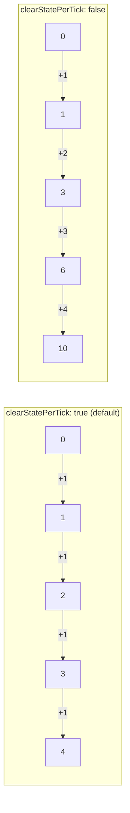

## Summary

Replaced two HOW-assertion tests in `common/episode_runner_test.ts` that stubbed
`creature.clearState` and asserted on the _number of invocations_ (`clears === 4`, `clears === 0`).
Counting an internal helper's calls verifies the _mechanism_, not the _outcome_ — a refactor of the
episode loop (batching clears, resetting inline, or clearing via a different call) would keep the
observable episode result identical yet break those assertions. This violates the project's
[Testing Philosophy](../../../AGENTS.md) (only "what" tests allowed). Closes #529.

The fix follows the issue's **Option (a)**: assert the _observable_ effect of the
`clearStatePerTick` flag through the returned `trace`, using a stub creature whose recurrent state
is visible in its activation output.

### Approach

The flag's only caller-visible effect is whether recurrent creature state carries across ticks. The
new tests model that directly with a tiny stub creature holding a single recurrent accumulator:

- `clearState()` resets the accumulator to `0`.
- `activate()` increments it and returns the running total as the output.

An `accumulatingWalker` adapter uses that output as its per-tick step delta, so any carry-over shows
up in the trace:

| `clearStatePerTick` | accumulator output | trace          |
| ------------------- | ------------------ | -------------- |
| `true` / default    | `1, 1, 1, 1`       | `[0,1,2,3,4]`  |
| `false`             | `1, 2, 3, 4`       | `[0,1,3,6,10]` |



A refactor of the loop internals that preserves behaviour leaves these traces unchanged, so the
tests no longer obstruct refactoring while still covering both flag states.

## Evidence

Backend/test-only change — no UI to screenshot. Verified via `deno test`:

```
running 10 tests from ./common/episode_runner_test.ts
...
ok | 10 passed | 0 failed (10ms)
```

`deno fmt --check` and `deno lint` both pass on the modified file.

## Test Plan

Existing call-count tests replaced (documented modification — the issue's whole purpose);
neighbouring good `result.steps`/`result.trace` WHAT-assertions retained. New/changed tests in
`common/episode_runner_test.ts`:

- `runEpisode — clears recurrent state per tick by default (observable via trace)` — asserts the
  default and explicit `clearStatePerTick: true` both yield `[0,1,2,3,4]`.
- `runEpisode — clearStatePerTick=false retains recurrent state across ticks` — asserts the
  accumulating trace `[0,1,3,6,10]` and `finalState === 10`.
- `runEpisode — clearStatePerTick toggles the observable episode trace` — asserts the two traces
  differ, proving the flag has a real caller-visible effect.
