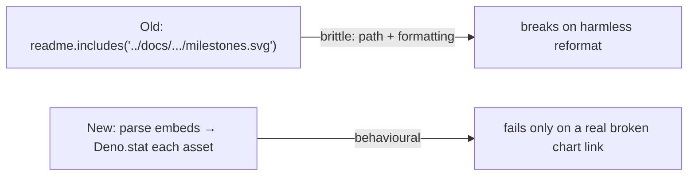

# Replace source-text grep assertions in mnist_classification_test.ts

## Summary

Removed two "how" tests (source-text grep-as-assertions, anti-pattern #2) from
`mnist_classification/mnist_classification_test.ts` and replaced the meaningful one with a
behavioural "what" test, per the project [Testing Philosophy](../../../AGENTS.md). Closes #530.

**1. `--allow-ffi` run.sh test — deleted (issue's Option b).** The test asserted the literal
substring `--allow-ffi` appears in `mnist_classification/run.sh`. The flag has since moved into the
shared preamble (`NEAT_EXAMPLE_DENO_FLAGS` via `common/example_runner_preamble.sh`), so the
substring now matches only the _descriptive comment_ in `run.sh`, not any granted permission — the
test passed on doc text, not behaviour, and would fail on a harmless comment reword. The behaviour
it stood proxy for (every Discovery runner is granted FFI) is already covered behaviourally in
`common/run_sh_permissions_test.ts`:

- `example runner preamble grants required Deno flags`
- `every run.sh that loads Discovery uses shared Deno flags with --allow-ffi`

A documenting comment was left in place of the deleted test recording the removal and pointing to
the behavioural coverage.

**2. README chart-embed test — rewritten behaviourally (issue's Option a).** The old test asserted
exact relative image paths (`../docs/screenshots/mnist_classification/milestones.svg`, …) were
present and that historical strings (`evolution_summary.svg`, `tracked in #273`) were absent —
coupling to doc-tree layout and documentation formatting, not behaviour. The replacement parses
every markdown image embed in the README and asserts each local asset resolves to a **non-empty file
on disk** — the real behaviour (no broken chart links). It couples only to the chart pipeline's
artefact filenames (`milestones.svg`, `complexity.svg` — a stable output contract) to confirm both
headline charts stay embedded, not to the brittle relative path. The formatting-absence greps were
dropped as they assert no behaviour.

## Why this is in scope

`run.sh`'s FFI permission is validated behaviourally elsewhere
(`common/run_sh_permissions_test.ts`), so the mnist substring check was redundant; the README
path/absence checks verify documentation formatting, not functionality. Both align with the repo's
prohibition on "how" tests.

## Test changes

- **Deleted** `mnist run.sh grants --allow-ffi for Discovery and evolveDir training` (redundant +
  only matched a comment). Replaced by an explanatory comment.
- **Replaced** `README embeds the multi-run charts and drops the legacy evolution_summary path` with
  `every chart embedded in the mnist README resolves to a non-empty asset` — a behavioural
  broken-embed test.
- Added `dirname`, `normalize` to the `@std/path` import.

## Test Plan

- `deno test mnist_classification/mnist_classification_test.ts common/run_sh_permissions_test.ts` —
  51 passed, 0 failed.
- Verified the new test **fails** when a referenced asset is removed (temporarily moved
  `milestones.svg` → `NotFound`/assertion failure), then **passes** once restored — confirming it
  catches the real regression rather than tracking source text.
- `./quality.sh` — the only failure was the pre-existing stochastic
  `evolveCartPoleController champion generalises …` cart_pole test (unrelated to this change; passes
  on rerun). No mnist or permissions tests regressed.

## Evidence

CLI/test-only change — no UI. Evidence is the test runs above.
