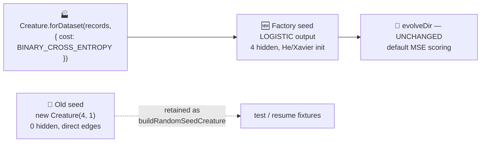

# PR Summary — adaptive_mutation: build the initial creature via the NEAT-AI factory (#533)

## Summary

Migrated the `adaptive_mutation` example to seed its fresh run via the NEAT-AI **factory**
`Creature.forDataset(records, { cost: "BINARY_CROSS_ENTROPY" })` instead of a bare
`new Creature(4, 1)`. **Only the seed changes — evolution is untouched:** `evolveDir` keeps its
default MSE scoring and the example still converges (faster, in fact — 955 generations / 1 m 1 s vs
the prior 1440 / 1 m 26 s). This is a deliberate, milestone-sanctioned departure from the
no-warm-start policy, made under the factory-adoption tracker (#517) and matching the merged MNIST
(#518), Stock Market (#519), and XOR (#520) adoptions. Closes #533.

### Cost / activation coupling chosen

The `classification_task` driver is a 4-bit even-parity classifier (4 → 1, binary) with `{0, 1}`
targets, classified via a `>= 0.5` threshold on a single output. So the cost is
**`BINARY_CROSS_ENTROPY`**, which couples the output activation to a **LOGISTIC** sigmoid
([NEAT-AI #2793](https://github.com/stSoftwareAU/NEAT-AI/issues/2793)) — the exact activation the
threshold interface and `{0, 1}` MSE both assume. This is the same cost / activation pairing as the
XOR adoption (#520).

The factory derives, from problem-intrinsic facts only:

- output activation coupled to the cost (LOGISTIC);
- a conservative hidden-capacity budget (Heaton's rule → a small RELU hidden layer);
- per-activation weight-init scaling (He / Xavier).

Seed weights and biases remain **random** — only topology and scaling are factory-derived, and all
structural growth beyond the seed still comes from the unchanged mutation operators.

## Changes

- `adaptive_mutation/adaptive_mutation.ts`
  - Added `CLASSIFICATION_COST = "BINARY_CROSS_ENTROPY"`, `FactoryRecords`,
    `datasetToFactoryRecords()`, `buildSeedCreature()` (factory), and `buildRandomSeedCreature()`
    (the bare-constructor baseline, **retained for test / resume fixtures**).
  - `runAdaptiveMutationDemo` now builds the seed via
    `Creature.fromJSON(buildSeedCreature(datasetToFactoryRecords(trainingSet), config.seed))`. No
    hardcoded hidden-layer sizes remain.
- `adaptive_mutation/README.md` — documents the factory call and the deliberate departure; refreshed
  the "Latest Measured Run" table with the new factory-seeded numbers.
- `AGENTS.md` — added the `adaptive_mutation` factory exception alongside MNIST / Stock Market.
- `docs/factory_adoption.md` — moved `adaptive_mutation` to ✅ Migrated and updated the adoption
  flow diagram.
- Regenerated `docs/screenshots/adaptive_mutation.svg` and
  `.../adaptive_mutation/evolution_summary.svg`.

## Seed change at a glance

## Evidence

CLI / library change — no web UI to screenshot. Verified by the unit-test suite and a full
end-to-end run of `./adaptive_mutation/run.sh`:

| Metric                   | Value (factory seed)            |
| ------------------------ | ------------------------------- |
| Generations              | 955 (solved — targetError 0.05) |
| Wall-clock               | 1 m 1 s                         |
| Final training accuracy  | 1.0000 (16/16)                  |
| Held-out accuracy        | 1.0000                          |
| Seed neurons / synapses  | 9 / 20 (4 factory hidden)       |
| Final neurons / synapses | 11 / 27                         |

The factory hidden layer ships with random weights, so gen-1 accuracy still sits around chance; the
network grows and tunes from there to 1.0000 — the captured "noise → competent" arc preserved.

## Test Plan

`deno test adaptive_mutation/` — 46 passed, 0 failed. New "what" tests in
`adaptive_mutation/adaptive_mutation_test.ts`:

- `buildSeedCreature` — right arity; LOGISTIC output coupled to `BINARY_CROSS_ENTROPY`; data-derived
  hidden layer (> 0 hidden); deterministic weights/biases per seed; valid finite `[0, 1]` outputs;
  rejects an empty record set.
- `datasetToFactoryRecords` — mirrors the dataset's inputs and targets.
- `buildRandomSeedCreature` (retained baseline) — zero hidden neurons, pinned LOGISTIC output,
  deterministic per seed, valid finite output.
- `CLASSIFICATION_COST` equals `BINARY_CROSS_ENTROPY`.

No existing tests were removed or commented out. Repo-wide `deno lint`, `deno check **/*.ts`, and
`deno fmt --check` (for the changed files) pass.

## Security self-check

- No new external input surface; the factory reads the in-memory deterministic truth-table dataset.
- No secrets, credentials, or hidden files staged.
- No new SQL / shell / HTTP / filesystem injection surface.
