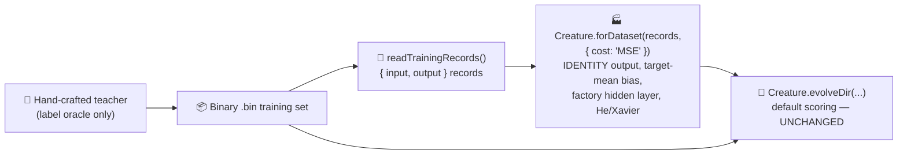

# PR Summary — evolution_showcase: build the initial creature via the NEAT-AI factory (#534)

## Summary

Builds the `evolution_showcase` fresh-run seed via the data-derived NEAT-AI factory
`Creature.forDataset(records, { cost: "MSE" })` instead of a bare `new Creature(4, 1)`. **Only the
seed changes** — `evolveDir` keeps its default scoring and configuration, and all structural growth
beyond the seed still comes from the unchanged mutation operators. This is a deliberate,
milestone-sanctioned departure from the no-warm-start policy, made under the factory-adoption
tracker (#517). Closes #534.

### Cost / activation coupling chosen for this example

The hand-crafted teacher emits an **unbounded continuous target** through a linear (`IDENTITY`)
output, and the run is scored on per-record **mean-squared error**, so this showcase is a
**regression** task. The matching factory cost is therefore **`MSE`**, which couples the seed's
output activation to a **linear `IDENTITY` output** and warm-starts the output bias to the target
mean — the same cost / activation pairing adopted by the stock-market example (#519, see NEAT-AI
#2793 for the coupling). From problem-intrinsic facts only, the factory additionally sizes a
conservative hidden-capacity budget (Heaton's rule) and scales the random weights to the
per-activation init stddev (He / Xavier). Seed weights and biases stay random; only topology and
scaling are factory-derived.

The bare `new Creature(4, 1)` seed is retained as `buildRandomSeedCreature` — the historical
baseline used by the tests / resume fixtures.

## Evidence

This is a backend / CLI example with no web interface to screenshot. Verification is by unit tests
plus a full end-to-end flagship run.

### Converges faster than the old baseline (acceptance: "as before, or faster")

Full run reproduced via `./evolution_showcase/run.sh`:

| Metric                   | Old bare-seed baseline          | New factory seed (#534)          |
| ------------------------ | ------------------------------- | -------------------------------- |
| Seed neurons / synapses  | 5 / 4 (0 hidden)                | 9 / 20 (4 factory-sized hidden)  |
| Generations              | 14 368                          | 8 362                            |
| Wall-clock               | 20 m 17 s (hit backstop)        | 6 m 29 s (early exit)            |
| Final per-record error   | 0.1070 (target 0.05 **missed**) | 0.0499 (target 0.05 **reached**) |
| Final score              | 0.8930                          | 0.9501                           |
| Final neurons / synapses | 41 / 230                        | 30 / 107                         |

The better-conditioned factory scaffold lets NEAT-AI reach `targetError` and exit early in ≈ 6.5
minutes — strictly faster and to a lower error than the bare-seed baseline, which previously timed
out at the 20-minute backstop. Structural growth beyond the seed still happens (9 → 30 neurons, 20 →
107 synapses), so the noise → competent arc is intact.

### Deliberate departure documented

- `AGENTS.md` — `evolution_showcase` entry updated with the factory-adoption exception (#534).
- `docs/factory_adoption.md` — Group A status flipped to ✅ Migrated.
- `evolution_showcase/README.md` — factory call shown, dedicated "Deliberate departure" section,
  updated mermaid + measured-run table; H1 retitled to "From a Factory Seed".
- `evolution_showcase/run.sh` — header / banner updated.

## Test Plan

`deno test evolution_showcase/evolution_showcase_test.ts` — 21 passed (11 new "what" tests):

- `REGRESSION_COST is the MSE regression cost`
- `readTrainingRecords reads the .bin set into well-shaped factory records`
- `readTrainingRecords throws when the directory holds no .bin files`
- `buildRandomSeedCreature` — bare baseline (INPUT_COUNT in, 0 hidden, OUTPUT_COUNT out),
  deterministic, valid creature with finite output
- `buildSeedCreature` — correct I/O arity; picks a linear `IDENTITY` output from the regression
  cost; sizes a data-derived hidden capacity budget; deterministic for a given seed; valid creature
  with finite output; rejects an empty record set
- `the factory seed adds structure over the retained bare baseline`

Existing tests (teacher creature, `prepareDataset`, stop-condition contract,
`runMinimalSeedShowcase` end-to-end, SVG rendering) continue to pass unchanged. `deno lint` and
`deno fmt --check` are clean for all changed files.
