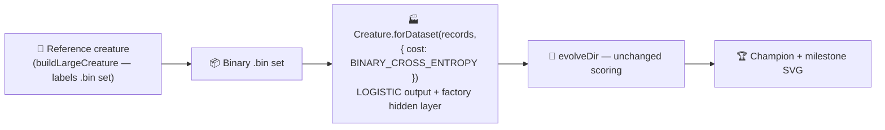

## Summary

Built the `discovery_at_scale` fresh-run seed via the data-derived NEAT-AI factory
`Creature.forDataset(records, { cost: "BINARY_CROSS_ENTROPY" })` instead of a bare
`new Creature(INPUT_COUNT, OUTPUT_COUNT)` (factory-adoption tracker #517). Only the seed changes —
`evolveDir` keeps its default scoring, so evolution beyond the seed is untouched. Closes #535.

### Cost / activation coupling chosen for this example

The hand-crafted reference creature (`buildLargeCreature(...)`) labels the binary `.bin` set through
a **LOGISTIC** output, so every target lives in `(0, 1)`. `BINARY_CROSS_ENTROPY` couples the
factory's output activation to a LOGISTIC sigmoid (NEAT-AI #2793) across all three outputs — the
exact activation the labelled targets assume. This is the same cost / activation pairing used by the
merged XOR (#520) and `adaptive_mutation` (#533) adoptions, here applied to a 3-output problem. The
factory also derives a conservative factory-sized hidden layer (Heaton's rule → a small RELU layer)
and per-activation He/Xavier weight-init scaling, all from problem-intrinsic facts. Seed weights and
biases stay random; structural growth beyond the seed still comes purely from `evolveDir`'s
unchanged mutation operators.

### Deliberate, milestone-sanctioned departure

`discovery_at_scale` is an **exempt** example in `AGENTS.md` (the reference creature is the demo's
hand-crafted state), but the NEAT seed itself was a bare constructor. Migrating that seed to the
factory is a deliberate departure from the no-warm-start policy, sanctioned under tracker #517 and
documented in `AGENTS.md`, `docs/factory_adoption.md`, and the example README. The bare-constructor
seed is retained as `buildRandomSeedCreature` for test / resume fixtures.

### Measured result — converges far faster

| Metric                   | Bare seed (was)          | Factory seed (now)          |
| ------------------------ | ------------------------ | --------------------------- |
| Generations              | 15&nbsp;185              | 83                          |
| Wall-clock               | 20 m 0 s                 | 5.1 s                       |
| Final per-record error   | 0.075 (never hit target) | 0.0049 (**reached** target) |
| Final score              | 0.925                    | 0.9951                      |
| Seed neurons / synapses  | 9 / 18                   | 16 / 63 (7 factory hidden)  |
| Final neurons / synapses | 37 / 193                 | 19 / 61                     |

The better-scaled, hidden-bearing factory seed reaches the tight `targetError` (0.005) in ~5
seconds, where the bare seed never reached it inside the full 20-minute backstop. Committed
milestone SVGs (`docs/screenshots/discovery_at_scale.svg` and
`.../discovery_at_scale/evolution_summary.svg`) were regenerated from this run.

## Evidence

Backend/CLI change — no web interface to screenshot. Verified via the demo runner
(`./discovery_at_scale/run.sh`), which reached `targetError` in 83 generations / 5.1 s and
regenerated the committed milestone SVGs, plus the unit-test suite below (27 passed).

## Test Plan

Added to `discovery_at_scale/discovery_at_scale_test.ts` (all "what" tests calling real functions):

- `SEED_COST couples the output to a LOGISTIC sigmoid` — locks the cost choice.
- `loadDatasetRecords - reads back inputs and outputs ...` — full `{ input, output }` records loaded
  from the `.bin` set, targets verified in `[0, 1]`.
- `buildRandomSeedCreature retains the bare baseline (zero hidden neurons)` — historical baseline.
- `buildFactorySeedCreature` — correct I/O arity + valid creature; LOGISTIC output from the cost;
  data-derived hidden layer present; finite `[0, 1]` outputs; deterministic for a given seed;
  rejects an empty record set.

Existing tests retained unchanged and still pass (`deno test` → 27 passed / 0 failed). `deno fmt`,
`deno lint`, and `deno check` are clean on the changed module.
