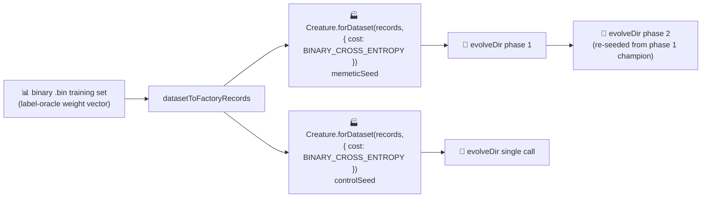

# memetic_evolution: build the initial creature via the NEAT-AI factory

## Summary

Migrated the `memetic_evolution` example so **both** `evolveDir` seeds (memetic + control) are built
via the NEAT-AI factory `Creature.forDataset(records, { cost: "BINARY_CROSS_ENTROPY" })` instead of
a bare `new Creature(2, 1)`. Only the seed changes — `evolveDir` keeps its default scoring, so
evolution is untouched and the example still converges below `targetError` (and **faster** than the
previous bare-seed baseline). Migrating both seeds keeps the memetic / control comparison fair.

The factory derives, from problem-intrinsic facts only: a **LOGISTIC** output activation coupled to
the cost, a conservative factory-sized hidden layer (Heaton's rule), and per-activation weight-init
scaling (He / Xavier). Seed weights and biases remain random — only topology and scaling are
factory-derived — and all structural growth beyond the seed still comes from the unchanged mutation
operators. This is a **deliberate, milestone-sanctioned departure** from the no-warm-start policy in
`AGENTS.md` and `docs/factory_adoption.md`, made under the factory-adoption tracker (#517).

The bare-constructor seed is retained as `buildRandomSeedCreature` for test / resume fixtures.

Closes #536.

### Cost / activation coupling chosen for this example

The label oracle (`forward`) emits a LOGISTIC probability in `[0, 1]`, so the training targets are
soft probabilities in that range and the demo's held-out metric is −MSE on those targets.
`BINARY_CROSS_ENTROPY` is the cost whose factory pairing yields a **LOGISTIC** output (NEAT-AI
#2793) — the activation whose bounded `(0, 1)` range matches the `[0, 1]` targets and the −MSE
scoring. This is the same cost / activation coupling used by the merged XOR (#520) and
adaptive_mutation (#533) adoptions. By contrast, a bare `new Creature(2, 1)` ships an unbounded
**Mish** output, so the factory seed is both better-shaped for the task and the reason both runs now
converge faster.

## Evidence

CLI/library example — no web UI to screenshot. Verified by running the example end-to-end and the
unit-test suite.

**End-to-end run** (`deno run --allow-all memetic_evolution/memetic_evolution.ts`) — both runs
converge below `targetError = 0.005`, faster than the bare-seed baseline:

| Metric                | Memetic (factory) | Control (factory) | Bare-seed baseline (was) |
| --------------------- | ----------------- | ----------------- | ------------------------ |
| Generations           | 84                | 32                | 66 / 543                 |
| Wall clock            | 2.0 s             | 0.5 s             | 1.2 s / 5.0 s            |
| Final score (−MSE)    | 0.9953            | 0.9982            | 0.9964 / 0.9976          |
| Seed → final neurons  | 6 → 6             | 6 → 7             | 3 → 5 / 3 → 7            |
| Seed → final synapses | 9 → 9             | 9 → 16            | 2 → 8 / 2 → 13           |

Both seeds begin from the **same** factory topology (6 neurons / 9 synapses), so the memetic /
control comparison stays fair — the only difference remains the memetic run's explicit mid-run
re-seed. The headline SVG (`docs/screenshots/memetic_evolution.svg`) was regenerated against the new
numbers.

### Seed flow

## Test Plan

Added to `memetic_evolution/memetic_evolution_test.ts` (all "what" tests — call the real function
and assert on outputs):

- `SEED_COST couples the output to a LOGISTIC sigmoid`
- `datasetToFactoryRecords mirrors the dataset's inputs and output`
- `buildRandomSeedCreature is the bare baseline — zero hidden neurons`
- `buildRandomSeedCreature is deterministic for a given seed`
- `buildSeedCreature builds a factory seed with the right arity`
- `buildSeedCreature picks a LOGISTIC output from the seed cost`
- `buildSeedCreature sizes a data-derived hidden capacity budget`
- `buildSeedCreature is deterministic (weights/biases) for a given seed`
- `buildSeedCreature produces a valid creature with finite [0,1] outputs`
- `buildSeedCreature rejects an empty record set`

**Modified test (business-logic change, documented):**
`runMemeticAndControlEvolution returns two milestone summaries from minimal seeds` was renamed to
`... from factory seeds`. Its seed-count assertion changed from "exactly
`INPUT_COUNT + OUTPUT_COUNT` neurons" to "strictly more than `INPUT_COUNT + OUTPUT_COUNT`" because
the factory now pre-sizes a hidden layer. The call sites were updated for the new `records`
parameter. No test was removed or disabled.

Quality gates run: `deno fmt`, `deno lint`, `deno check **/*.ts`, and the full `deno test` suite
(1100 passed / 0 failed).
