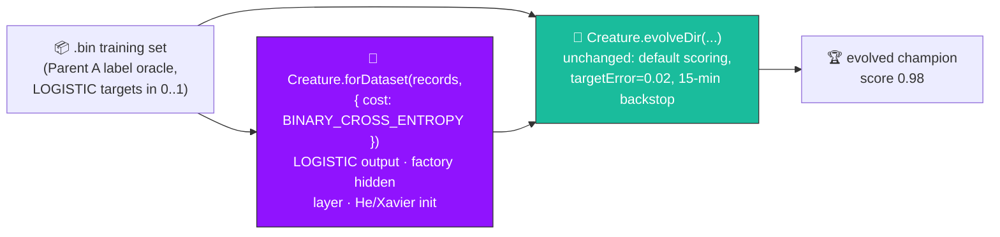

# Crossover — build the initial creature via the NEAT-AI factory (#537)

## Summary

The `crossover` example's second-stage evolution seed is now built via the data-derived NEAT-AI
factory `Creature.forDataset(records, { cost: "BINARY_CROSS_ENTROPY" })`
(`buildFactorySeedCreature`) instead of a bare `new Creature(3, 1)`. **Only the seed changes;
evolution is untouched** — the single `evolveDir` call keeps its default scoring and stop conditions
(`targetError = 0.02`, `timeoutMinutes = 15`). The factory derives, from problem-intrinsic facts
only, a LOGISTIC output coupled to the cost, a conservative factory-sized hidden layer (Heaton's
rule), and per-activation weight-init scaling (He / Xavier). Seed weights and biases stay random;
only topology and scaling are factory-derived, and all structural growth beyond the seed still comes
from the unchanged mutation operators. This is the next adoption under the factory-adoption tracker
(#517), mirroring the merged XOR (#520), adaptive_mutation (#533), discovery_at_scale (#535), and
memetic_evolution (#536) PRs.

This is a **deliberate, milestone-sanctioned departure** from the no-warm-start policy documented in
`AGENTS.md` and `docs/factory_adoption.md`. The hand-crafted parents (and the offspring bred from
them) are the breeding demo's hand-crafted state and live **outside** the NEAT seed, so the existing
`AGENTS.md` crossover exemption still holds. The bare-constructor seed is retained as
`buildRandomSeedCreature` — the historical baseline for test / resume fixtures.

Closes #537.

### Cost / activation coupling chosen for this example

Parent A is the **label oracle**: its output neuron is a LOGISTIC sigmoid, so every `.bin` target
lives in `(0, 1)`. `BINARY_CROSS_ENTROPY` is the cost whose factory output activation is a LOGISTIC
sigmoid (NEAT-AI #2793) — the exact activation the labelled targets assume. This matches the
held-out scoring and is the same cost / activation pairing used by the merged XOR,
adaptive_mutation, discovery_at_scale, and memetic_evolution adoptions.

## Evidence

Backend/CLI change — no web UI to screenshot. Verified by the regenerated milestone SVG and a real
(non-quick) `./crossover/run.sh`, which **converged faster than before** from the better-scaled
factory seed:

```
🌱 Step 5: Factory-seeded evolution (single evolveDir call)
   Seed: Creature.forDataset(records, { cost: "BINARY_CROSS_ENTROPY" }) — factory-derived topology + scaling, no warm-started weights.
   Seed topology: 7 neurons, 12 synapses
   Completed 66 generations in 2.1s (final error 0.0193)
   Champion topology: 7 neurons, 13 synapses (seed had 7 / 12)
   Evolved champion score: 0.980724
```

The run hit `targetError = 0.02` (final error 0.0193) in 66 generations / ~2.1s — well inside the
15-minute backstop. The factory seed starts with a pre-sized hidden layer (7 neurons / 12 synapses)
rather than the bare 4 neurons / 3 synapses, and evolution proceeds unchanged.



## Test Plan

New tests in `crossover/crossover_example_test.ts` (all "what" tests — call real functions, assert
on results):

- `loadDatasetRecords reads the right number of records with correct arity` — happy path.
- `loadDatasetRecords round-trips Parent A's labelled targets` — re-activating the oracle on each
  loaded input reproduces the stored `(0, 1)` target.
- `buildRandomSeedCreature is the bare baseline — zero hidden neurons` — baseline retained.
- `buildRandomSeedCreature is deterministic for a given seed`.
- `buildFactorySeedCreature builds a factory seed with the right arity`.
- `buildFactorySeedCreature picks a LOGISTIC output and pre-sizes a hidden layer` — cost/activation
  coupling + Heaton hidden layer.
- `buildFactorySeedCreature is deterministic (weights/biases) for a given seed`.
- `buildFactorySeedCreature produces a valid creature with finite [0,1] output`.
- `buildFactorySeedCreature rejects an empty record set` — error path.
- `runMinimalSeedEvolution accepts a factory seed and reports a pre-sized topology` — end-to-end the
  factory seed feeds the unchanged `evolveDir`.

Existing tests (including the bare-`new Creature(...)` baseline evolution test) are unchanged and
continue to pass: `deno test crossover/` → 36 passed / 0 failed. `deno fmt --check`, `deno lint`,
and `deno check` all clean on the changed files.

## Acceptance criteria

- [x] Seed built via `Creature.forDataset(records, { cost: "BINARY_CROSS_ENTROPY" })`; no hardcoded
      hidden-layer sizes remain.
- [x] Bare-constructor seed retained as `buildRandomSeedCreature` for test / resume fixtures.
- [x] Example README updated to show the factory call and document the deliberate departure.
- [x] Example still converges (faster — 66 gens / ~2.1s, error 0.0193); existing tests pass.
- [x] PR summary explains the cost / activation coupling chosen for this example.

## Deno regression avoided

- Kept the example, helpers, and tests on Deno-native APIs (`Deno.readFileSync`, `Deno.test`,
  `deno fmt` / `deno lint` / `deno check`) — no Node tooling or dependencies introduced.
