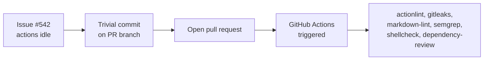

## Summary

GitHub Actions were not starting automatically, so this PR makes the trivial, documentation-only
edit requested in the issue to push a new commit and trigger the configured workflows. The change
adds this PR-summary document and makes no source-code or behaviour changes. Closes #542.

The intent mirrors the example referenced in the issue (PR #539): any new commit on a pull-request
branch is enough to kick the Actions runs.

## Evidence

This is a documentation/maintenance change with no web interface to screenshot and no runtime
behaviour to verify. Correctness is confined to the workflows running once the PR is opened.

Local checks run for this change:

- `deno fmt --check` — formatting clean (Markdown included).
- `markdownlint-cli2` — the new document lints clean.

## Test Plan

No code changed, so no unit tests were added or modified. The verification for this change is
operational: confirm the GitHub Actions workflows start automatically once the pull request is
opened.
