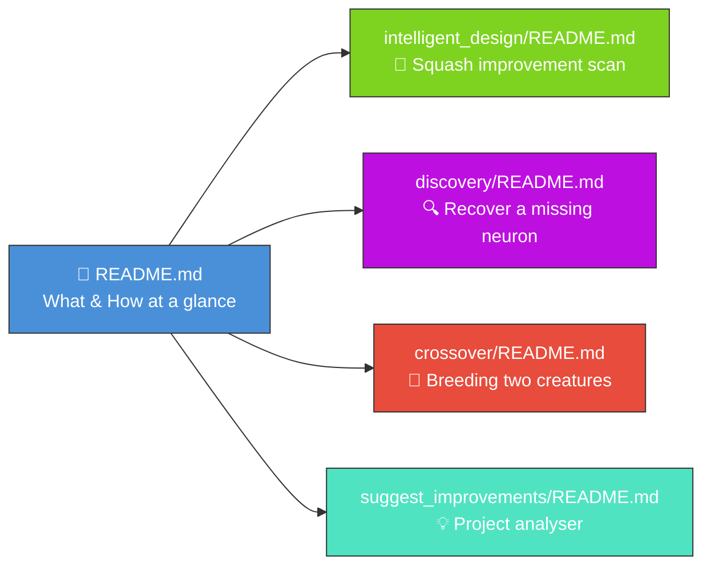

# Restructure main README around _what_ and _how_, link to per-example detail

## Summary

Refocused the main `README.md` on **what** the examples are and **how** to run them at a glance, and
moved the per-example deep-dive content (How It Works walkthroughs, run options, output artefacts,
and Discovery's FFI prerequisites) into per-example `README.md` files under each example directory.
The main README now opens with an "Examples at a Glance" table linking to each detail page, keeps
the high-level architecture and shared-utilities diagrams, and retains the Quality Check, Related
Repositories, and Contributing sections.

Closes #55.

## Evidence

This is a documentation-only change — no UI to screenshot. Verification is via the new
`readme_structure_test.ts` plus the existing `mermaid_diagrams_test.ts`,
`related_repositories_test.ts`, `contributing_test.ts`, and `lint_fmt_config_test.ts` — all 59
documentation tests pass:

```
ok | 59 passed | 0 failed (139ms)
```

`deno lint` and `deno fmt --check` are clean. Pre-existing WASM-runtime failures in the example
runners and pre-existing TypeScript type errors in the example sources (21 errors, 36 unit-test
failures) are present on the base branch (`Develop` @ 04b467b) before any of my changes — verified
via `git stash`. They are not introduced by this PR.

### New documentation layout



## Test Plan

- Added `readme_structure_test.ts` covering:
  - Each example directory has a non-empty `README.md` that begins with a level-1 heading and
    references its `run.sh` runner.
  - The main `README.md` links to every per-example `README.md`.
  - The main `README.md` names every example, has an Examples section, retains Prerequisites and
    Quality Check sections, and no longer duplicates the per-example "How It Works" walkthroughs.
- Verified `mermaid_diagrams_test.ts`, `related_repositories_test.ts`, `contributing_test.ts`, and
  `lint_fmt_config_test.ts` all still pass against the new README.
- `deno lint` and `deno fmt --check` clean.
