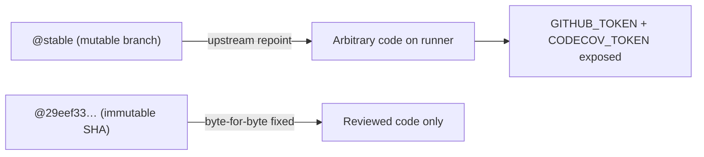

# Pin dtolnay/rust-toolchain to a commit SHA in quality.yml

## Summary

`.github/workflows/quality.yml` pinned the third-party action
`dtolnay/rust-toolchain` to the moving branch `@stable` — the lone unpinned
action in a repository where every other third-party action is already pinned
to an immutable 40-character commit SHA. A mutable branch ref is a supply-chain
risk: whoever controls the upstream repository can repoint `stable` at malicious
code, which would then execute on the runner with the job's `GITHUB_TOKEN` and
the secrets in scope (this job builds `rust_scorer` and reads `CODECOV_TOKEN`).

This change pins the action to the commit SHA at the tip of the upstream
`stable` branch and, because a SHA-pinned action can no longer infer the
toolchain from the ref name (as it did from the `@stable` branch), adds an
explicit `with: toolchain: stable` to preserve identical behaviour. The
human-readable tag is kept in a trailing comment, matching how the other pins
in this repository are maintained.

```diff
-      - name: Install Rust toolchain
-        uses: dtolnay/rust-toolchain@stable
+      - name: Install Rust toolchain
+        uses: dtolnay/rust-toolchain@29eef336d9b2848a0b548edc03f92a220660cdb8 # stable
+        with:
+          toolchain: stable
```

The pinned SHA `29eef336d9b2848a0b548edc03f92a220660cdb8` is the tip of
`dtolnay/rust-toolchain`'s `stable` branch (commit "toolchain: stable",
2026-03-27) — well outside the dependency-bump quarantine window.

Closes #552.

## Evidence

Backend/CI-only change — no web interface to screenshot. Verification was via
the new unit tests, `actionlint`, and a YAML parse check:

- New tests fail against the old `@stable` ref and pass after the fix.
- `actionlint .github/workflows/quality.yml` → OK.
- YAML parse confirms the step now reads
  `uses: dtolnay/rust-toolchain@29eef336d9b2848a0b548edc03f92a220660cdb8`
  with `toolchain: stable`.



## Test Plan

Added `.github/quality_workflow_test.ts` (mirrors the existing
`actionlint_workflow_test.ts` convention — parses the workflow YAML and asserts
on its contract, never greps source):

- `quality workflow — every uses: pins a 40-char commit SHA` — every `uses:` in
  `quality.yml` must pin a 40-character commit SHA. Reproduces #552: it fails
  against `dtolnay/rust-toolchain@stable` and passes after the fix.
- `quality workflow — rust-toolchain is SHA-pinned and keeps toolchain: stable`
  — the rust-toolchain step pins a 40-char SHA and sets
  `with: toolchain: stable` so the stable toolchain is retained.

Gates run (targeted — the full `quality.sh` example suite is unrelated to this
YAML/test change): `deno fmt --check`, `deno lint`, `deno check`,
`deno test --frozen` on the new file, and `actionlint` — all pass.
