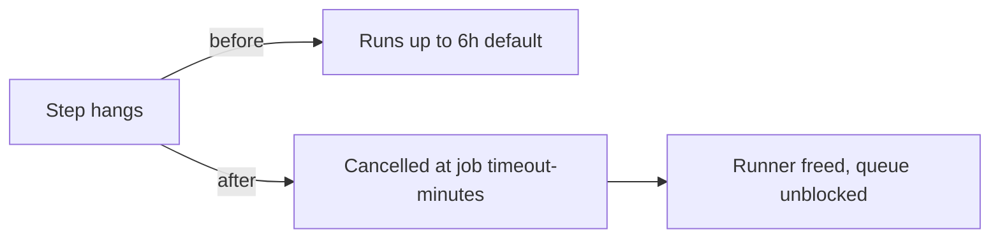

# Add `timeout-minutes` to every workflow job

## Summary

Every job across the repository's GitHub Actions workflows previously inherited GitHub's 6-hour
default timeout, so a hung step (a stalled download, a deadlocked `deno test`, an unending build)
could wedge a runner for hours and burn runner minutes. This change adds an explicit job-level
`timeout-minutes` to all eight jobs, bounding the blast radius of any hang. Closes #553

Timeouts are sized to each job's workload:

| Workflow                | Job                                           | `timeout-minutes` |
| ----------------------- | --------------------------------------------- | ----------------- |
| `quality.yml`           | `quality` (Rust build + full Deno test suite) | 30                |
| `deno-outdated.yml`     | `auto-bump` (dependency bump + audit)         | 30                |
| `actionlint.yml`        | `actionlint`                                  | 15                |
| `dependency-review.yml` | `dependency-review`                           | 15                |
| `gitleaks.yml`          | `gitleaks`                                    | 15                |
| `markdown-lint.yml`     | `markdownlint`                                | 15                |
| `semgrep.yml`           | `semgrep`                                     | 15                |
| `shellcheck.yml`        | `shellcheck`                                  | 15                |

The heavyweight jobs (`quality`, `auto-bump`) get 30 minutes; the lint/scan jobs comfortably fit
within 15.

## Evidence

This is a CI configuration change with no web interface to screenshot. Validation:

- **`actionlint .github/workflows/*.yml`** — passes cleanly, confirming the added `timeout-minutes`
  keys are syntactically valid and correctly placed within each job. This is the same linter the
  `actionlint` workflow runs in CI.
- **YAML parse check** — every workflow file parses without error.
- **Diff** — eight single-line additions, one per job, with no other changes:

## Test Plan

No unit test accompanies this change: it is pure CI workflow configuration, which has no runtime
code path to exercise — the repository's test philosophy covers the NEAT example behaviours, not
GitHub Actions YAML. The change is verified by `actionlint` (workflow schema validation) and a YAML
parse check, both run locally and passing. The existing `actionlint` workflow re-validates these
files on every push.
