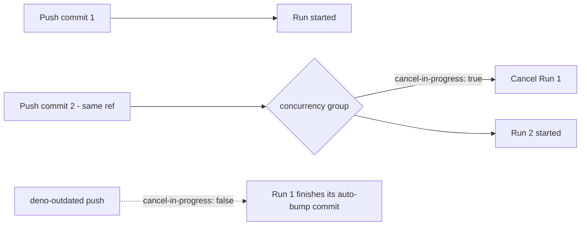

# Add a concurrency group to pull_request / push workflows

## Summary

Added a top-level `concurrency:` block to every CI workflow so that rapid pushes to a pull request
(or to `Develop`) no longer leave superseded runs running to completion. Each group is keyed on
`${{ github.workflow }}-${{ github.ref }}`, so a newer commit on the same ref cancels the older run
instead of queuing a duplicate — saving runner minutes (the expensive `quality` job runs a Rust
build plus the full Deno suite) and preventing out-of-order landings.

`deno-outdated.yml` is the one exception: it pushes auto-bump commits back to the PR head branch, so
it uses `cancel-in-progress: false` to avoid interrupting an in-flight push mid-commit. All other
workflows use `cancel-in-progress: true`.

Closes #554.

### Workflows updated

| Workflow                | `cancel-in-progress`                     |
| ----------------------- | ---------------------------------------- |
| `quality.yml`           | `true`                                   |
| `actionlint.yml`        | `true`                                   |
| `markdown-lint.yml`     | `true`                                   |
| `dependency-review.yml` | `true`                                   |
| `gitleaks.yml`          | `true`                                   |
| `semgrep.yml`           | `true`                                   |
| `shellcheck.yml`        | `true`                                   |
| `deno-outdated.yml`     | `false` (pushes commits back to PR head) |

## Evidence

This is a CI-configuration change — no web interface to screenshot. Behaviour is verified by a new
Deno test that parses each workflow YAML and asserts the concurrency block, group expression, and
`cancel-in-progress` value.

## Test Plan

- Added `.github/concurrency_workflow_test.ts` (16 tests):
  - Each of the 8 workflows declares a top-level `concurrency` block with
    `group: ${{ github.workflow }}-${{ github.ref }}`.
  - The 7 cancel-on-supersede workflows assert `cancel-in-progress: true`.
  - `deno-outdated.yml` asserts `cancel-in-progress: false`.
- Confirmed the test fails before the workflow edits (16 failed) and passes after (16 passed).
- `deno test --allow-read .github/` — 62 passed, 0 failed.
- `./quality.sh` — all examples passed.
