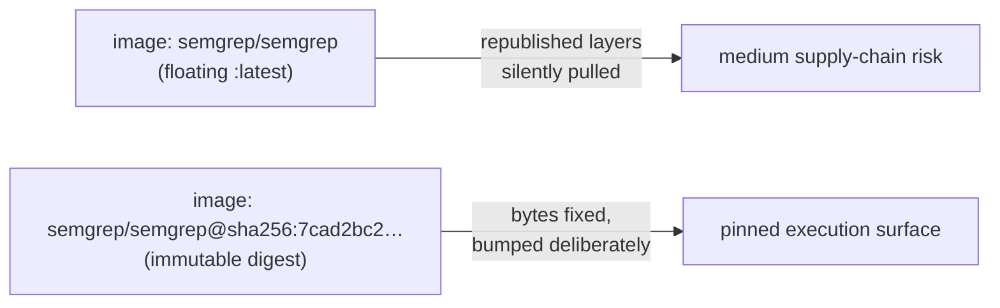

# Pin the semgrep/semgrep container image to a digest

## Summary

The Semgrep SAST workflow ran its job inside a job-level container pinned to a mutable tag —
`image: semgrep/semgrep` resolves to the floating `:latest` tag rather than an immutable `@sha256:`
digest. The image content behind that tag can be republished at any time, and the next run would
silently pull and execute the new layers on a runner that checks out PR-controlled code and has the
optional `SEMGREP_APP_TOKEN` secret in scope. The repository already pins every `uses:` action to a
40-character commit SHA; the container image was the one remaining unpinned third-party execution
surface.

Pinned the image to its current multi-arch digest, keeping the human-readable tag and the bump
command in a comment for traceability:

```yaml
container:
  # semgrep/semgrep:latest — pinned to an immutable digest (Issue #555).
  # Bump deliberately, the same way the action SHA pins are maintained:
  #   docker buildx imagetools inspect semgrep/semgrep:latest
  image: semgrep/semgrep@sha256:7cad2bc2d1e44f87f0bf4be6d1fa23aa90fb72015bebc89fb91385d813987a03
```

The digest was resolved against the Docker Hub registry API and confirmed to be the multi-arch OCI
image index (`application/vnd.oci.image.index.v1+json`), so the runner still resolves the correct
architecture from the index — no behaviour change, just an immutable pin.

Closes #555.

## Evidence

This is a CI/workflow configuration change with no web interface to screenshot. Verification is via
the new unit tests below, which parse the workflow YAML and assert the contract.



Digest resolution (registry API, no local Docker required):

```
docker-content-digest: sha256:7cad2bc2d1e44f87f0bf4be6d1fa23aa90fb72015bebc89fb91385d813987a03
mediaType: application/vnd.oci.image.index.v1+json
```

## Test Plan

Added `.github/semgrep_workflow_test.ts` (TDD — the digest test failed against the unpinned
workflow, then passed after the fix):

- **job container image is pinned to a sha256 digest** — the regression test for #555; parses the
  workflow and asserts every job-level `container.image` matches `@sha256:<64 hex>` rather than a
  floating tag.
- **every uses: pins a 40-char commit SHA** — guards the existing action pins.
- **runs on ubuntu-latest with read-only contents** — pins the runner and least-privilege permission
  contract.
- **actually invokes the semgrep CLI** — ensures the SAST scan still runs.
- **file exists and parses as YAML** — basic structural guard.

All 46 `.github/*_test.ts` tests pass; `deno fmt --check`, `deno lint`, and `deno check` are clean
on the new file.
