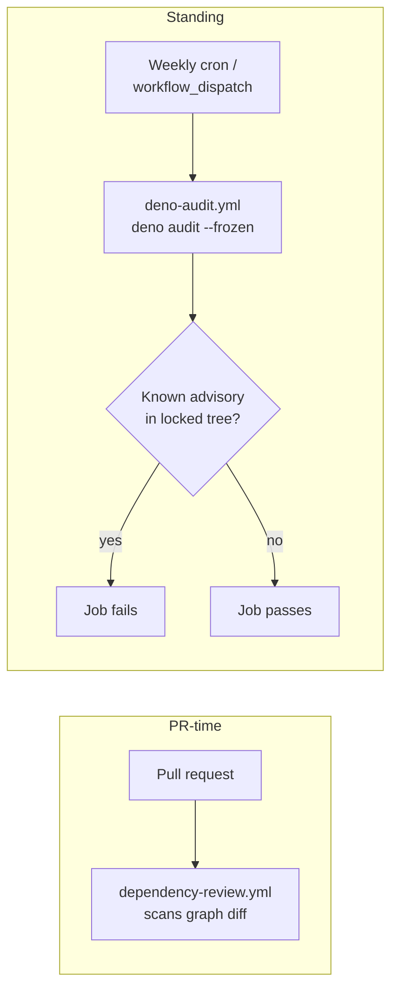

# PR Summary — SCR-VULN-SCAN: scheduled audit of the locked dependency tree

## Summary

Added a scheduled, Deno-native vulnerability scan of the **standing** locked dependency tree. The
existing `dependency-review.yml` only inspects the dependency-graph _diff_ of a pull request, so it
catches vulnerabilities a PR _introduces_ — but a CVE disclosed _later_ against a pin already on
`Develop` went unnoticed in CI until an unrelated PR happened to touch dependencies.

This PR closes that posture gap with a new `deno-audit.yml` workflow that runs `deno audit --frozen`
over `deno.json` / `deno.lock` on a weekly cron (plus manual `workflow_dispatch`). A newly-disclosed
advisory in any pinned JSR package (`@std/*`, `@stsoftware/*`) now fails a scheduled build rather
than sitting undetected. It complements — does not replace — the PR-time dependency-review action:
the action guards _incoming_ changes, this audit guards the _standing_ pin set.

Closes #572.

## Evidence

This is a CI/workflow change with no web interface to screenshot. Verified via:

- `deno audit --frozen` run locally against the current locked tree →
  `No known vulnerabilities found` (exit 0).
- New unit tests parse the workflow YAML and assert its contract (see below).
- Full `./quality.sh` passes cleanly (exit 0).

The action SHAs reuse the pins already trusted elsewhere in the repo (`actions/checkout` v6.0.2,
`denoland/setup-deno` v2.0.4), per the supply-chain hardening rules in `AGENTS.md`.

## Test Plan

Added `.github/deno_audit_workflow_test.ts` (mirrors the existing `*_workflow_test.ts` pattern),
which loads and parses `.github/workflows/deno-audit.yml` and asserts:

- the workflow file exists and parses as YAML with at least one job;
- it runs on a `schedule:` cron (the standing detector) with a well-formed cron expression;
- it supports manual `workflow_dispatch`;
- it actually invokes `deno audit`;
- every `uses:` action is pinned to a 40-character commit SHA;
- it runs on `ubuntu-latest` with read-only `contents` permission.

All six tests fail against the unfixed tree (no workflow) and pass after adding the workflow.
