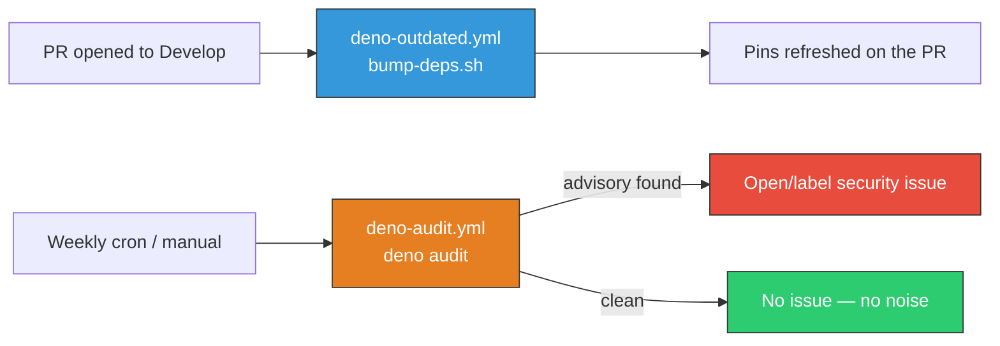

# Add a security-only dependency-update channel (`deno-audit.yml`)

## Summary

The repo had dependency-bumping automation (`deno-outdated.yml` + `bump-deps.sh`) but **no
security-specific update channel**. Routine bumps run only when a PR is opened against `Develop`
and the workflow deliberately carries no cron — "never as scheduled bot noise" (#364). That left a
gap: when an advisory (CVE) lands against a pin that is already current, nothing proactively raises
a fix, so the team had to notice it manually.

This PR adds [`.github/workflows/deno-audit.yml`](../../../.github/workflows/deno-audit.yml), a
**security-only** channel that is distinct from routine version churn so the maintainers' "no
scheduled bump noise" stance is preserved:

- Runs `deno audit` on a weekly cron (and on demand via `workflow_dispatch`).
- The channel is **advisory-driven** — a clean audit produces no PR and no issue, so it does not
  re-introduce the bump noise removed in #364.
- When `deno audit` finds a known advisory against a pinned dependency, it opens (or updates, to
  de-duplicate) a `security`-labelled issue, giving a freshly-disclosed CVE an automated path to a
  remediation issue.

A `deno audit`-gated issue (rather than a `.github/dependabot.yml`) is the more reliable security
channel here because Dependabot has limited Deno/JSR manifest support — and #364 already removed
Dependabot from this repo to stop weekly bot PRs.

The routine `deno-outdated.yml` workflow is unchanged: it keeps its no-cron, PR-only behaviour.

Closes #573.

## Evidence

This is a CI/workflow change with no web interface to screenshot. Verification is via the Deno
test suite that pins the workflow contract, plus `actionlint` (with `shellcheck`) on the new YAML.

```text
$ actionlint -verbose .github/workflows/deno-audit.yml
verbose: Found total 0 errors in 38 ms for .github/workflows/deno-audit.yml

$ deno test --no-check --allow-read .github/deno_audit_workflow_test.ts
ok | 7 passed | 0 failed

$ deno test --no-check --allow-read .github/*_test.ts
ok | 69 passed | 0 failed
```

The two dependency-update channels:



### Deno regression avoided

- Chose a Deno-native `deno audit` workflow over re-introducing a Node-tooling `.github/dependabot.yml`
  security channel (Dependabot has limited Deno/JSR support, and #364 already removed it).

## Test Plan

Added `.github/deno_audit_workflow_test.ts` (7 tests) which load and parse the workflow YAML and
assert real behaviour:

- runs on a weekly `schedule` cron (advisory-driven channel);
- supports manual `workflow_dispatch`;
- requests `issues: write` so it can open the remediation issue;
- invokes `deno audit`;
- only opens/labels an issue when the audit reports a non-empty result (gated on the step output),
  and the issue carries a `--label` so it routes to the security channel;
- pins every third-party action to a 40-char commit SHA;
- does **not** bump pins (no `bump-deps.sh` / `deno update` / `deno outdated`) — the channel stays
  advisory-only.

All `.github` workflow tests (69) pass, along with `deno fmt --check`, `deno lint`, `deno check`,
`markdownlint-cli2`, and `actionlint`.
