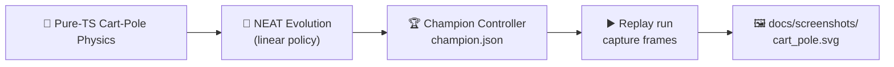

## Summary

Adds a new self-contained `cart_pole/` example that evolves a NEAT-AI controller to balance an
inverted pole on a moving cart, then renders a multi-frame SVG snapshot of the champion's run for
the README. Closes #58.

The example is intentionally simple — a pure-TypeScript cart-pole simulator (Florian 2007 / OpenAI
Gym `CartPole-v1`), a four-input/one-output linear NEAT creature, and a hand-rolled generational
evolutionary loop that uses the existing `common/deterministic_random.ts` PRNG for reproducibility.
With the default seed the controller reaches the maximum 500 timesteps in a single generation, so
`./cart_pole/run.sh` finishes in well under a second.

## Evidence



The committed `docs/screenshots/cart_pole.svg` (8 evenly-spaced frames) shows the champion balancing
across the full 500-step run.

Cart-Pole is a backend/CLI example with no web UI to screenshot; verification is via tests and the
end-to-end runner output below:

```text
🎢 Cart-Pole Balancing Example
🧪 Sanity check: hand-crafted tilt-direction policy
   Hand-crafted policy survived 90 steps.

🧬 Evolving controller...
   Gen   0  best=500  mean=  39.5

✅ Solved after 1 generations (best=500).
💾 Saved champion to .synthetic-cart-pole/creatures/champion.json
🖼️  Wrote screenshot docs/screenshots/cart_pole.svg (501 frames captured)
🏁 Example completed in 16ms
```

## Test Plan

New test files (all under `cart_pole/`) — every assertion calls real functions and checks observable
behaviour:

- `cart_pole/physics_test.ts` — 11 tests covering `initialState`, `step`, `isFailed`, and
  `encodeState`. Verifies that a stationary cart with a vertical pole stays vertical at zero
  gravity, that positive/negative force accelerates the cart in the expected direction, that an
  uncontrolled tilted pole falls within ~200 steps, and that failure thresholds are flagged
  correctly.
- `cart_pole/cart_pole_test.ts` — 12 tests covering genome construction, mutation, scoring,
  evolution, replay, and SVG output. Includes the issue's required hand-crafted "always push toward
  pole-tilt direction" sanity check (>50 steps) and asserts that `evolveCartPoleController` reaches
  `MAX_STEPS` with the default seed and that `renderRunSVG` emits the requested number of frame
  groups.

Existing tests updated to recognise the new example:

- `readme_structure_test.ts` — adds `cart_pole` to `EXAMPLE_DIRS` and "Cart-Pole" to the README name
  list.
- `docs/archive_test.ts` — allows `pr-summary-58.md` in the docs root.

Wiring:

- `quality.sh` runs `./cart_pole/run.sh` after the existing examples and cleans
  `.synthetic-cart-pole/`.
- `cart_pole/run.sh` re-formats the regenerated SVG via `deno fmt` so subsequent `deno fmt --check`
  runs stay clean.

The pre-existing `quality.sh` failures (Deno type-check errors in `intelligent_design/` and a WASM
network-permission error in the crossover/discovery tests) are unrelated to this change — they
reproduce on the unmodified `Develop` branch.
