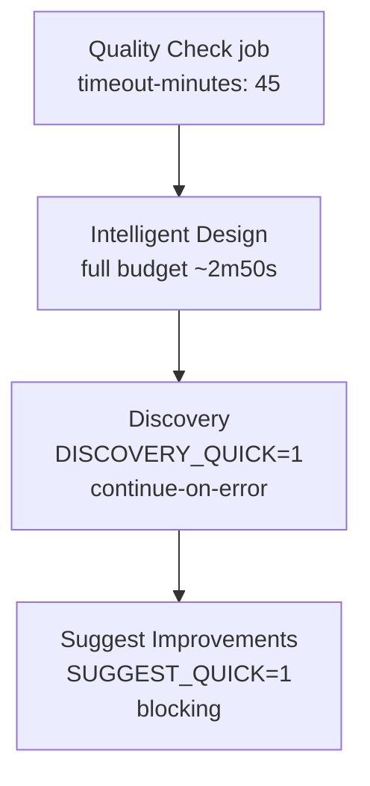

## Summary

The per-PR `Quality Check` workflow (`.github/workflows/quality.yml`) was hitting its 30-minute
`timeout-minutes` cap because the example steps ran at full budget — the Discovery example alone
burns its 15-minute internal budget. This PR runs the CI example steps in quick mode (matching
`quality.sh`) and raises the workflow timeout to 45 minutes as headroom. Closes #581

Changes:

- **Run Discovery example** — added `env: DISCOVERY_QUICK: "1"` (matching `quality.sh`, issue #375).
  The step keeps `continue-on-error: true` because the native FFI discovery library is still
  unavailable in CI; quick mode simply stops the step from wasting its full 15-minute budget.
- **Run Suggest Improvements example** — added `env: SUGGEST_QUICK: "1"` (matching `quality.sh`,
  issue #388). The step stays blocking (no `continue-on-error`).
- Raised the `quality` job `timeout-minutes` from `30` to `45`.
- Left the **Run Intelligent Design example** step unchanged (≈2m50s at full budget, no quick-mode
  flag).

Both run scripts already accept these flags (`discovery/run.sh` allows `DISCOVERY_QUICK`,
`suggest_improvements/run.sh` allows `SUGGEST_QUICK`), so step-level `env` is sufficient.

## Evidence

This is a CI/workflow configuration change with no web interface to screenshot. Verification was via
the YAML workflow tests and `actionlint`:

- `actionlint .github/workflows/quality.yml` → passes (the #508 gate).
- `deno test --allow-read .github/quality_workflow_test.ts` → 5 passed, 0 failed.

## Test Plan

Added three structural "what" tests to `.github/quality_workflow_test.ts` (they parse the YAML and
assert on the parsed values, in the same style as the existing SHA-pin tests):

- `quality workflow — Discovery example runs in quick mode and stays non-blocking` — asserts the
  Discovery step has `env.DISCOVERY_QUICK === "1"` and retains `continue-on-error: true`.
- `quality workflow — Suggest Improvements example runs in quick mode and stays blocking` — asserts
  the Suggest Improvements step has `env.SUGGEST_QUICK === "1"` and has no `continue-on-error`.
- `quality workflow — job timeout has headroom above the example budget` — asserts the `quality` job
  `timeout-minutes` is `45`.

All five tests in the file pass; `deno lint` and `deno fmt` are clean.
