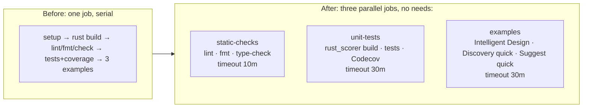

# CI: split Quality Check into parallel jobs

## Summary

Split the single `quality` job in `.github/workflows/quality.yml` into three independent parallel
jobs so the per-PR critical path is the slowest job rather than the sum of every step. No check is
dropped and no new example coverage is added — the existing step set is partitioned across the three
jobs. Closes #582.

The Rust build (the only consumer of the `NEAT_AI_RUST_SCORER_*` env vars) and its scorer/core
checkouts now live solely in the unit-tests job, so the ~2-minute build is no longer on the examples
critical path.

## Job breakdown

- **static-checks** (timeout 10m) — checkout, Deno setup + cache, frozen install, `deno lint`,
  `deno fmt` (apply, as before), `deno check -- **/*.ts`.
- **unit-tests** (timeout 30m) — checkout, Deno setup + cache, frozen install, NEAT-AI-scorer +
  NEAT-AI-core checkouts, sibling symlink, Rust toolchain, `rust_scorer` build, the full unit-test
  step (including the `ensure_neat_ai_native_scorer.sh` probe and the `EVOLVE_INTEGRATION_FILTERS`
  loop), lcov generation, and Codecov upload.
- **examples** (timeout 30m) — checkout, Deno setup + cache, frozen install, then Intelligent Design
  (blocking), Discovery (`continue-on-error: true`, `DISCOVERY_QUICK: "1"`), Suggest Improvements
  (blocking, `SUGGEST_QUICK: "1"`).

## Preserved invariants

- The `${{ inputs.pr_head_ref || github.ref }}` checkout ref (workflow_dispatch auto-bump support)
  is kept in every job.
- The Deno dependency cache and frozen-lockfile install (#418) are kept in every job.
- The workflow-level `concurrency` group (#554) and `permissions: contents: read` are unchanged.
- Quick-mode envs and Discovery's `continue-on-error: true` (#581) carry into the examples job.

## ⚠️ Branch-protection note for the reviewer

The required-status-check context changes from one job to three. The old context
**`Run quality checks`** no longer exists; the new contexts are:

- **`Static checks`**
- **`Unit tests + coverage`**
- **`Examples`**

Update the Develop branch-protection required-status-checks to reference these three names so PRs
are gated correctly.

## Evidence

CLI/CI-only change — no web interface to screenshot. Verified locally:

- `actionlint .github/workflows/quality.yml` → exit 0 (the #508 gate passes).
- `deno test --allow-read .github/quality_workflow_test.ts` → 8 passed, 0 failed.
- `deno fmt --check .github/` → 19 files clean; `deno lint` clean.

## Test Plan

Updated `.github/quality_workflow_test.ts`:

- Replaced the obsolete single-`quality`-job timeout test (the `quality` job no longer exists after
  the split) with coverage of the new structure.
- Added `split into three parallel jobs with no inter-job needs` — asserts the three job keys exist
  and none declares `needs:` (parallel execution).
- Added `each job sets its own timeout with headroom` — asserts every job sets a `timeout-minutes`
  of at least 10.
- Added `rust_scorer build lives only in the unit-tests job` — asserts the Build rust_scorer step is
  present in unit-tests and absent from static-checks and examples.
- Added `every job preserves the bump-aware checkout ref and frozen install` — asserts each job
  keeps the `pr_head_ref || github.ref` checkout ref and the frozen-lockfile install.

The existing SHA-pinning, rust-toolchain, and quick-mode example tests are unchanged and still pass
(they iterate over all jobs).
