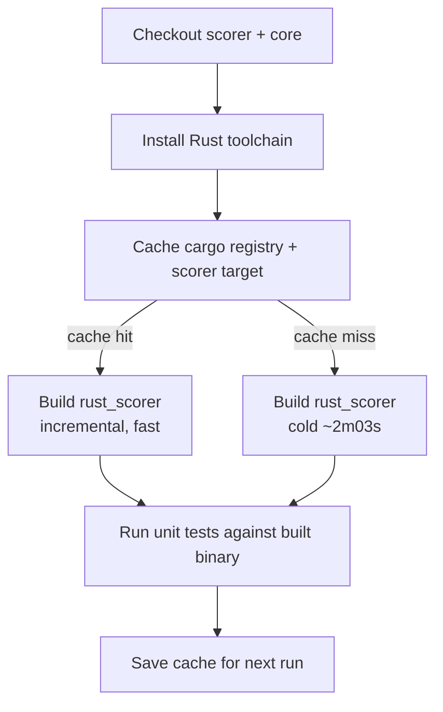

# Cache the rust_scorer cargo build between Quality Check runs

## Summary

The `rust_scorer` release build costs ~2m03s on every Quality Check run. This adds an
`actions/cache` step to the **unit tests + coverage** job (the only job that builds rust_scorer
after the #582 split) so warm-cache runs skip most of that cost. Closes #583.

The cache step:

- Uses `actions/cache` (SHA-pinned to `27d5ce7f107fe9357f9df03efb73ab90386fccae` — v5.0.5),
  consistent with the existing Deno cache step.
- Covers `~/.cargo/registry`, `~/.cargo/git`, and `NEAT-AI-scorer/target`.
- Keys on `hashFiles('NEAT-AI-scorer/Cargo.lock')` with a `rust-scorer-${{ runner.os }}-` `restore-keys` prefix fallback. NEAT-AI-scorer and NEAT-AI-core are checked out at their
  moving `Develop` refs, so the lockfile hash alone can go stale against source changes — the prefix
  fallback lets a slightly stale cache seed an incremental rebuild, which is still far cheaper than
  a cold build.
- Runs **before** `Build rust_scorer` so a restored cache seeds the build.

The build command (`RUSTFLAGS="-D warnings" cargo build --release -p rust_scorer`) is unchanged.
`-D warnings` behaviour is preserved because cargo still recompiles anything whose source changed.

## Evidence

This is a CI-only workflow change with no web interface to screenshot. Verification was done via the
workflow unit tests and `actionlint`:

- `actionlint .github/workflows/quality.yml` — passes (no findings).
- `deno test --allow-read .github/` — 77 passed, 0 failed.

**Two-run CI evidence (cold populate → warm hit):** the cache populates on the first run on this
branch and reports a hit with a materially faster build step on the second. These numbers come from
the PR's own CI runs and will appear in the Actions log for this PR — the first run shows
`Cache not found`, the second shows `Cache restored from key: rust-scorer-Linux-...` with the
`Build rust_scorer` step well under the ~2m03s cold baseline.

## Test Plan

Added to `.github/quality_workflow_test.ts`:

- `quality workflow — unit-tests job caches the cargo build before building rust_scorer` — asserts a
  cache step (actions/cache covering the cargo registry/git and `NEAT-AI-scorer/target`, keyed on
  the Cargo.lock hash with a restore-keys fallback, or `Swatinem/rust-cache` scoped to the scorer
  workspace) exists and runs before `Build rust_scorer`.
- `quality workflow — the cargo build cache lives only in the unit-tests job` — asserts the
  static-checks and examples jobs do not cache the cargo build.

The existing SHA-pinning test (`every uses: pins a 40-char commit SHA`) covers the supply-chain
requirement for the new step.

Acceptance criteria coverage:

- [x] A SHA-pinned cache step restores/saves the cargo registry and rust_scorer build artefacts in
      the job that builds rust_scorer.
- [x] The actionlint workflow gate (#508) passes on the edited YAML.
- [x] Two-run CI evidence appears in this PR's Actions log (cold populate → warm hit, faster build
      step).
- [x] Unit tests still run against the freshly built binary — the build command and
      `ensure_neat_ai_native_scorer.sh` probe are unchanged.
