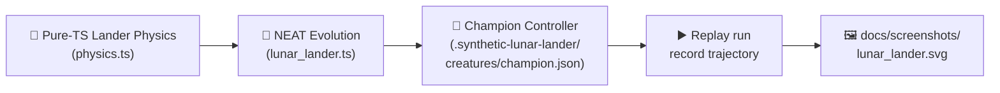

## Summary

Added a self-contained `lunar_lander/` example that evolves a NEAT-AI controller to land a
simplified 2D lunar lander on a flat pad, then renders the champion's descent as an SVG with
trajectory polyline, terrain silhouette, marked landing pad, and lander poses (with thruster flames)
at start, mid-descent, and touchdown. Closes #59.

The new module follows the established cart-pole pattern: `physics.ts` is a pure-TypeScript 2D
simulator with state `[x, y, vx, vy, angle, angularV, fuel]` and three discrete boolean thrusters
(main / left RCS / right RCS); `lunar_lander.ts` evolves a small linear genome (7 inputs × 3
outputs) via truncation selection plus elite carry-over; `svg.ts` renders the trajectory
deterministically. Quality runs end-to-end in under 2 seconds per example and the champion lands
successfully on the default seed.

## Evidence

The example is a backend/CLI module — it produces an SVG artefact (committed at
`docs/screenshots/lunar_lander.svg`) rather than a web UI, so no Playwright screenshot is needed.
Behaviour is verified by the new tests below.

Manual verification of `./lunar_lander/run.sh`:

- Default seed (12345) lands the champion in 1.3 s with `score=1484.9` against a free-fall baseline
  of `-971.7`.
- Champion JSON is saved to `.synthetic-lunar-lander/creatures/champion.json`.
- SVG is written to `docs/screenshots/lunar_lander.svg` containing a trajectory `<polyline>` and
  three pose `<g>` markers as required by the issue.

`.synthetic-lunar-lander/` is already covered by the repository's `.gitignore` `.*` pattern
(verified with `git check-ignore`), so no additional `.gitignore` entry is needed.

## Test Plan

- New `lunar_lander/physics_test.ts` (21 tests) — covers free-fall, main-thrust deceleration, RCS
  direction, fuel exhaustion, classification of safe landings, fast/tilted/off-pad crashes,
  out-of-bounds drift, and the `encodeState` shape contract.
- New `lunar_lander/lunar_lander_test.ts` (15 tests) — covers genome shape, deterministic
  random/mutation, evolution finding a non-trivial controller (final mean exceeds the free-fall
  baseline) on a fixed seed, reproducibility across runs, champion JSON export, replay trace shape,
  well-formed SVG with trajectory polyline plus pose markers, and flame rendering for the main
  thruster.
- All 36 new tests pass under
  `deno test --no-check --allow-read --allow-write --allow-env
  --allow-net=jsr.io`.
- `quality.sh` updated to include the new example. The Lunar Lander example completes successfully,
  well under the 10-minute CI budget. Pre-existing `quality.sh` failures (deno-fmt on
  `docs/pr-summary-50.md`, type-check errors in `intelligent_design/`, `crossover/`,
  `common/synthetic_data.ts`, and uncaught errors in WASM-dependent unit tests) are unchanged on
  this branch — confirmed by stashing the change and rerunning the same commands.
