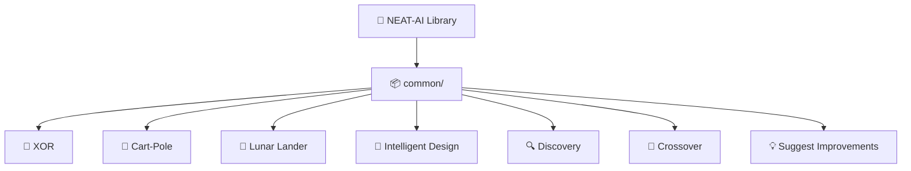

# Update main README to showcase new examples with screenshots

## Summary

Surfaces the three new examples (XOR, Cart-Pole, Lunar Lander) on the main `README.md`. Adds rows to
the **Examples at a Glance** table, a new **Screenshots** section embedding the committed SVGs, and
extends both top-level Mermaid diagrams to include the new modules. The structural and Mermaid tests
have been widened to assert each new section, table row, and diagram node. Closes #60.

## Evidence

The change is documentation-only; reviewers can preview the rendered README directly on GitHub.

The structure is now:

Embedded screenshots (existing committed files):

- `docs/screenshots/xor_decision_boundary.svg`
- `docs/screenshots/cart_pole.svg`
- `docs/screenshots/lunar_lander.svg`

`./quality.sh` passes end-to-end (lint, fmt, type-check, all tests, all example runners).

## Test Plan

- `readme_structure_test.ts` extended with:
  - `xor_classification` and `lunar_lander` added to the per-example link/heading checks.
  - `XOR` and `Lunar Lander` added to the names-by-introduction list.
  - New `Screenshots` section heading assertion.
  - Per-screenshot tests asserting both the README embed and the file on disk.
- `mermaid_diagrams_test.ts` widened to assert each diagram mentions XOR, Cart-Pole, and Lunar
  Lander.
- `docs/archive_test.ts` allowlist updated to permit the new `pr-summary-57.md` and
  `pr-summary-60.md` files until they are archived.
- Full `./quality.sh` run passes with the new content (310+ tests passing, all example runners
  green).
