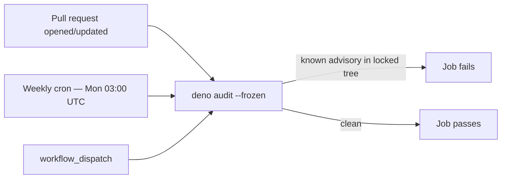

# SCR-VULN-SCAN — audit the locked dependency set on every PR

## Summary

`SCR-VULN-SCAN` requires a CI step that scans the **resolved** dependency set for _known_
vulnerabilities. The standing detector already existed as the weekly `deno-audit.yml` (Issue #572),
but it fired only on a `schedule` cron and `workflow_dispatch`. That left a window: a CVE disclosed
against an already-pinned `@std/*`, `@stsoftware/*`, or transitive package could sit undetected for
up to a week, and `dependency-review.yml` would not catch it because that action only inspects the
**diff** a PR introduces — never the existing pins.

This change adds a `pull_request` trigger to `deno-audit.yml` so the standing pin set (`deno.json` /
`deno.lock`) is re-audited via Deno's native `deno audit --frozen` on **every PR**, while the weekly
cron remains as the out-of-band detector for periods when no PR is open. The trigger uses
`branches: ["**"]` (not `["*"]`) so PRs against base branches containing a `/` still trigger the
audit (Issue #435) — matching the convention already used by `dependency-review.yml`.

Closes #600.

## Evidence

This is a CI/workflow change with no web interface to screenshot. It is verified by the contract
tests in `.github/deno_audit_workflow_test.ts`, which parse the workflow YAML and assert its trigger
set.

Audit cadence after this change:

The two detectors are complementary:

| Workflow                | Scope                               | Cadence               |
| ----------------------- | ----------------------------------- | --------------------- |
| `dependency-review.yml` | dependency **diff** a PR introduces | per PR                |
| `deno-audit.yml`        | the **standing** locked pin set     | per PR **and** weekly |

## Test Plan

`.github/deno_audit_workflow_test.ts` (all 7 tests pass):

- **Added** `deno-audit workflow — runs on every pull_request (Issue #600)` — asserts the
  `pull_request` trigger exists and uses the `["**"]` all-branches glob. This test fails against the
  pre-change workflow (verified) and passes after adding the trigger.
- Existing tests continue to pass: scheduled cron, `workflow_dispatch`, `deno audit` invocation,
  40-char SHA pinning, and `ubuntu-latest` with read-only `contents` permission.

Also verified:

- `deno fmt --check` and `deno lint` on the modified test — clean.
- `actionlint` across all workflows — exit 0.
