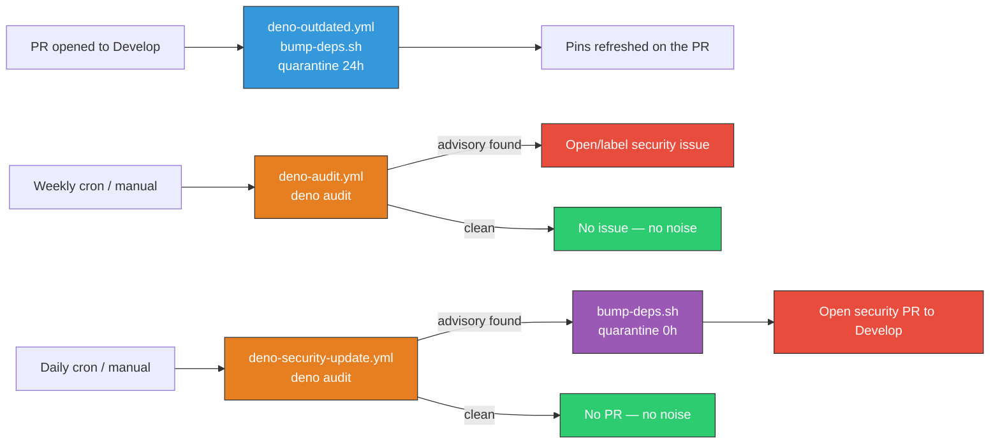

# Add advisory-driven security-update channel

## Summary

`SCR-AUTO-UPDATE` fired because the repo had a quarantine-aware updater but
**no security-update-specific channel**: a CVE disclosed against an
already-pinned dependency triggered nothing. The two existing pieces left a gap
between them:

- `deno-outdated.yml` — the **freshness** channel. Bumps pins, but only
  `on: pull_request` to `Develop`, behind the routine 24h quarantine
  (`VIBE_BUMP_QUARANTINE_HOURS=24`, #441), and deliberately with **no cron**
  (#364).
- `deno-audit.yml` — the **detector** (#572). Runs `deno audit` weekly but only
  **fails the build**; it never raises the patch.

This PR adds the missing **remediation** channel,
`.github/workflows/deno-security-update.yml`. It runs `deno audit` on a daily
cron (plus `workflow_dispatch`) and, when an advisory is found in the locked
tree, fast-tracks a patch through the existing `bump-deps.sh` updater with
`VIBE_BUMP_QUARANTINE_HOURS=0` — security fixes bypass the routine 24h
quarantine because a disclosed advisory means the currently-pinned version *is*
the risk. The patch is pushed to a fresh `security/` branch and a PR is opened
against `Develop`, out-of-band and independently of the PR-time bumper.

I chose the Deno-native option from the issue (schedule `deno audit` →
fast-track `bump-deps.sh` with quarantine 0) over the Dependabot suggestion:
every import in `deno.json` is a `jsr:` pin, which a Dependabot `npm` ecosystem
config would not cover, and adding Node tooling to this Deno repo would be a
regression. Reusing `bump-deps.sh` keeps a single, auditable update path.

### Deno regression avoided

- Implemented the advisory-driven channel with Deno-native `deno audit` +
  `bump-deps.sh` instead of adding a Node-only `.github/dependabot.yml`
  (`npm` ecosystem), which would not cover the repo's `jsr:` pins.

Closes #601.

## Evidence

Backend/CI change — no web interface to screenshot. Verified via the new
contract tests, `actionlint`, and the full quality gate (`./quality.sh` →
"All examples passed!").

```
$ deno test --allow-read .github/deno_security_update_workflow_test.ts
ok | 9 passed | 0 failed

$ actionlint .github/workflows/deno-security-update.yml
(exit 0)
```

The three dependency channels after this change:



## Test Plan

New `.github/deno_security_update_workflow_test.ts` pins the channel contract
(parses real YAML and asserts on the structure — no source grepping):

- runs on a `schedule:` cron **and** supports manual `workflow_dispatch`;
- runs `deno audit` to detect the advisory (the gate);
- invokes `bump-deps.sh` to apply the patch (reuses the existing updater);
- pins `VIBE_BUMP_QUARANTINE_HOURS` to `"0"` so security fixes are fast-tracked
  past the routine 24h quarantine;
- opens a PR via `gh pr create` so the patch lands out-of-band;
- every `uses:` action is pinned to a 40-character commit SHA;
- runs on `ubuntu-latest` with `contents: write` + `pull-requests: write`.

Also updated `.github/concurrency_workflow_test.ts` to register the new workflow
in the no-cancel list (it pushes a branch and opens a PR, so it must not be
interrupted mid-commit) — this gives the new workflow concurrency-group
coverage too.

Full `./quality.sh` passes cleanly with the new tests.
