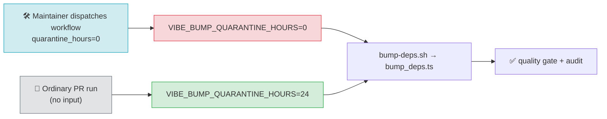

# Document an auditable emergency override for the dependency quarantine

## Summary

`SCR-QUARANTINE-OVERRIDE` — the repo enforces a 24-hour supply-chain quarantine on external
dependency bumps (`VIBE_BUMP_QUARANTINE_HOURS`), but there was no auditable, documented fast-lane to
bypass that window when a dependency is being actively exploited. `SECURITY.md` already described the
local `VIBE_BUMP_QUARANTINE_HOURS=0 ./bump-deps.sh` override (added under #574); the remaining gap
called out in the issue was the absence of a `workflow_dispatch` override input on the CI workflow.

This PR closes that gap by exposing the existing knob as an explicit, auditable workflow input:

- **`.github/workflows/deno-outdated.yml`** — adds a `workflow_dispatch` trigger with a
  `quarantine_hours` input (default `"24"`), and wires the job env to
  `VIBE_BUMP_QUARANTINE_HOURS: ${{ inputs.quarantine_hours || '24' }}`. On an ordinary
  pull-request run the input context is empty, so the full 24-hour quarantine still applies; only an
  explicit manual dispatch with `quarantine_hours=0` opens the fast-lane, and the chosen value is
  recorded against the run for audit. The job now also runs on `workflow_dispatch` (not just
  same-repo PRs), with `github.ref_name` / `GITHUB_REF_NAME` fallbacks for the checkout, push, and
  re-dispatch steps that previously assumed a PR-head context.
- **`SECURITY.md`** — adds an "Auditable CI fast-lane" subsection documenting the
  `gh workflow run deno-outdated.yml --ref <branch> -f quarantine_hours=0` path alongside the
  existing local override.

Closes #603.

## Evidence

This is a CI-workflow and documentation change with no web interface to screenshot. Verification was
done via the test suite and static-analysis gates.

Checks run locally (stdin redirected from `/dev/null`):

- `deno test` — 6 passed (3 new in `deno_outdated_override_test.ts`, 3 existing in
  `security_md_test.ts`).
- `deno fmt --check` and `deno lint` — clean on the changed files and workflow YAML.
- `actionlint .github/workflows/deno-outdated.yml` — no findings.
- `markdownlint-cli2 SECURITY.md` — 0 errors.

## Test Plan

Added `deno_outdated_override_test.ts`, which parses the workflow YAML (`@std/yaml`) and asserts the
deliverable's structure rather than grepping source text:

- `deno-outdated workflow allows manual dispatch` — a `workflow_dispatch` trigger exists.
- `workflow_dispatch exposes a quarantine_hours override input` — the input exists, defaults to
  `"24"`, and carries a non-empty description.
- `quarantine env honours the override input with a 24h fallback` — the job env reads
  `inputs.quarantine_hours` and falls back to `24`.

These tests fail against the pre-change workflow (no override input) and pass after the change.
