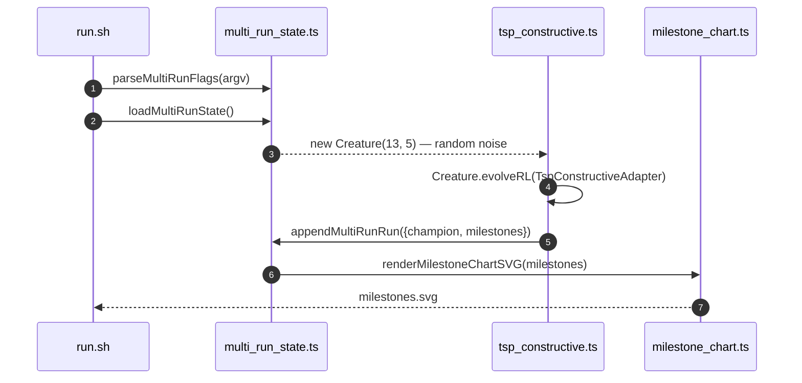

## Summary

Fixed the three pre-existing quality-gate findings tracked in the baseline-carryover
tracker for this repo. Closes #605.

- **[shellcheck] `quality.sh:112` SC2035** — changed `deno check **/*.ts` to
  `deno check ./**/*.ts` so filenames beginning with a dash cannot be mistaken for
  options. Shell glob expansion is unchanged (globstar is not enabled), so the set of
  type-checked files is identical.
- **[shellcheck] `quality.sh:215` SC2329** — `cleanup_deno_wrapper` is invoked
  indirectly by the `trap cleanup_deno_wrapper EXIT` immediately below it, which
  shellcheck cannot trace. Added a scoped `# shellcheck disable=SC2329` with an
  explanatory comment rather than deleting a function that is genuinely used.
- **[mermaid] `tsp_constructive/README.md:145`** — renamed the sequence-diagram
  participant `Loop` to `Driver`. `Loop` collides (case-insensitively) with Mermaid's
  reserved `loop` keyword, which made Mermaid mis-parse subsequent statements as
  `loop ... end` blocks. All four references in the diagram were renamed consistently.

## Evidence

Backend/shell/documentation change only — no web interface to screenshot.

Verification performed:

- `shellcheck quality.sh` — SC2035 and SC2329 no longer reported. (The remaining
  SC1091 info about the sourced `common/ensure_neat_ai_native_scorer.sh` is pre-existing,
  unrelated to this tracker, and expected without `shellcheck -x`.)
- `grep -n "Loop" tsp_constructive/README.md` — no remaining `Loop` references.
- `deno fmt --check tsp_constructive/README.md` — passes.

Corrected sequence diagram (participant renamed `Loop` → `Driver`):

## Test Plan

No automated tests were added. The fixes are lint-style (shellcheck) and documentation
(Mermaid) corrections with no runtime behaviour change. Per this repo's testing
philosophy (`AGENTS.md`), the only way to "test" these would be to grep source text for
patterns — an explicitly forbidden "how" test. Verification is therefore via the
shellcheck / grep / `deno fmt` checks listed under Evidence.
