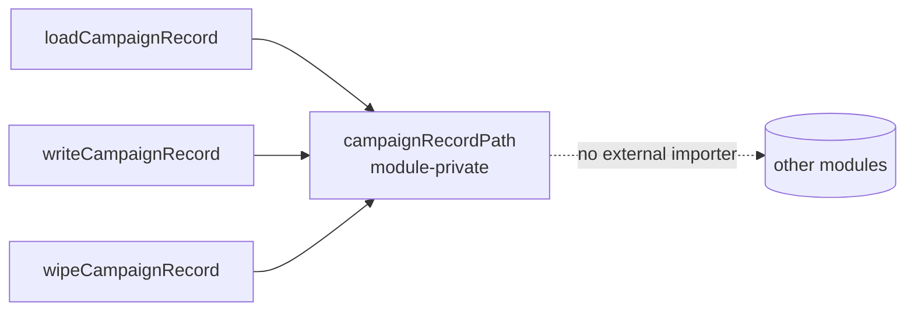

# Make `campaignRecordPath` module-private

## Summary

Removed the unused `export` modifier from `campaignRecordPath` in
`common/campaign_record.ts`, narrowing it to a module-private helper.
Module-graph analysis confirmed it has **no importer** anywhere in the
repository — `grep -rnw campaignRecordPath` across `.ts`/`.js`/`.md`/`.json`
returns hits only inside its own file, and `deno doc` no longer lists it on
the public surface after the change. Its three internal call sites
(`loadCampaignRecord`, `writeCampaignRecord`, `wipeCampaignRecord`) are
unaffected, so behaviour is unchanged. Closes #620.

## Evidence

Backend/library change only — no web interface to screenshot.

Verification commands (all clean):

- `deno fmt --check` — clean
- `deno lint` — checked 168 files, no findings
- `deno check ./**/*.ts` — type-checks across the repo
- `deno doc common/campaign_record.ts` — `campaignRecordPath` no longer
  appears in the public surface
- `deno test --parallel --allow-all common/` — **202 passed, 0 failed**

## Test Plan

No new tests were added — the change is a pure public-surface narrowing
with no behavioural change, and the AGENTS.md testing policy forbids
source-grep ("how") tests. The existing
`common/campaign_record_test.ts` already exercises `campaignRecordPath`
indirectly through the public functions that call it:

- `startCampaignRecord then appendCampaignPhase tracks wall-clock and best score`
- `wipeCampaignRecord removes the JSON file`

Both pass after the change, confirming the now-private helper still
resolves the JSON path correctly.
