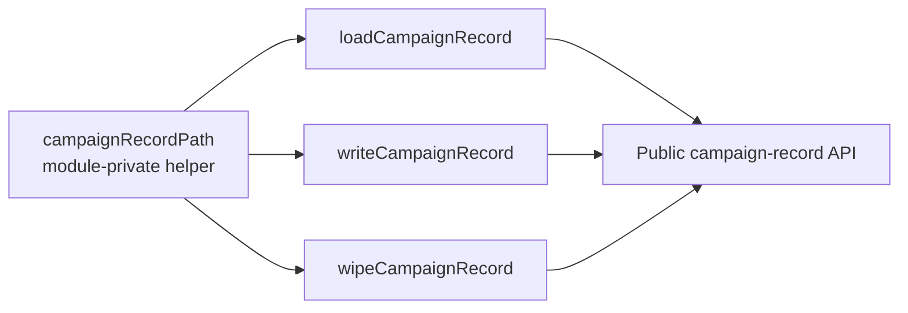

## Summary

Narrowed the unused export `campaignRecordPath` in `common/campaign_record.ts` to a
module-private helper by removing its `export` keyword. Module-graph analysis confirmed
the symbol had no importer anywhere in the repository — its only call sites are the sibling
functions `loadCampaignRecord`, `writeCampaignRecord`, and `wipeCampaignRecord` within the
same file. The function itself is still required internally, so only the `export` modifier
was dropped; all three call sites are unaffected.

Closes #620.

### Verification of the dead-code claim

```
grep -rnw campaignRecordPath .   # zero matches outside common/campaign_record.ts
```

No `.ts`/`.js`/`.md`/`.json` file references the identifier, there is no barrel re-export,
and no dynamic/string lookup — so removing the `export` cannot break any consumer.

## Evidence

Backend/library change with no web interface — no screenshot applies. Validated via the
Deno quality gates:

- `deno lint` — clean (168 files).
- `deno check ./**/*.ts` — clean.
- `deno fmt --check common/campaign_record.ts common/campaign_record_test.ts` — clean
  (the 7 pre-existing unformatted files in `docs/` are unrelated and left untouched per
  change-scope rules).
- Full unit suite: `1175 passed | 0 failed`.



## Test Plan

- Existing tests retained unchanged: `startCampaignRecord then appendCampaignPhase tracks
  wall-clock and best score` and `wipeCampaignRecord removes the JSON file` — these exercise
  the now-private helper indirectly through the public API.
- Added `common/campaign_record_test.ts::startCampaignRecord writes to
  <baseDir>/data/<slug>/campaign_record.json`, which asserts the path-resolution side effect
  lands at the expected location, keeping the private helper's behaviour covered.
- All three tests pass: `ok | 3 passed | 0 failed`.
