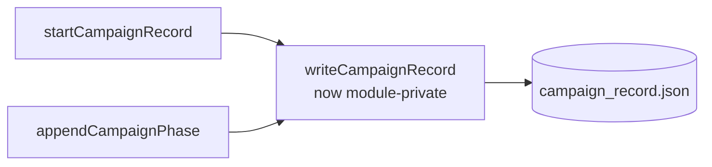

# PR Summary — Issue #621

## Summary

Removed the unused `export` modifier from `writeCampaignRecord` in `common/campaign_record.ts`,
narrowing it to a module-private helper. A repo-wide search (`grep` across
`.ts`/`.md`/`.json`/`.js`) confirms no module imports `writeCampaignRecord`; its only call sites are
the sibling helpers `startCampaignRecord` and `appendCampaignPhase` within the same file. The
neighbouring `wipeCampaignRecord` export (the only `campaign_record.ts` symbol an example imports —
`mnist_classification`) is untouched. This is a behaviour-neutral public-surface narrowing. Closes
#621.

## Evidence

Backend/CLI change with no web interface to screenshot. Verified via the existing unit tests and the
static checks below.

- `deno test common/campaign_record_test.ts` — 3 passed, 0 failed.
- Full unit suite
  (`deno test --parallel … --ignore=mnist_classification/evolve_integration_test.ts`) — 1175 passed,
  0 failed.
- `deno lint` — clean (168 files). `deno check ./**/*.ts` — clean. `deno fmt --check` on the changed
  file — clean (pre-existing unformatted docs data/JSON files elsewhere are out of scope and were
  not touched).

## Test Plan

No new test was needed: the existing `common/campaign_record_test.ts` already exercises
`writeCampaignRecord` indirectly through its two public callers — the
`startCampaignRecord then appendCampaignPhase …` and
`startCampaignRecord writes to <baseDir>/data/<slug>/campaign_record.json` tests both assert the
JSON side effect the private helper produces. These serve as the regression coverage that the
now-private helper still works after the change. Adding a test that imported `writeCampaignRecord`
directly would re-widen the very surface this issue narrows, so it was deliberately avoided.
