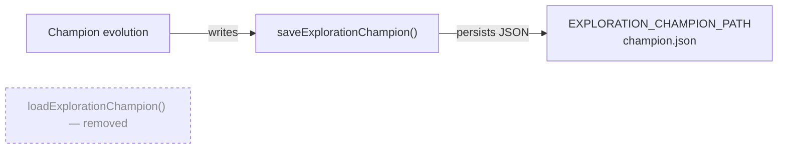

# Remove dead export `loadExplorationChampion`

## Summary

Removed the unused exported async function `loadExplorationChampion` (and its JSDoc) from
`mnist_classification/exploration_campaign.ts`. Module-graph analysis and a repo-wide grep confirmed
the identifier appeared exactly once — its own declaration — with no importing `.ts` file, no test
caller, no barrel re-export, and no dynamic/string reference in any `.sh`/`.md`/`.json` file. There
is no resume/restart flow depending on it. Its symmetric counterpart `saveExplorationChampion`
remains in active use and is retained. The shared `EXPLORATION_CHAMPION_PATH` constant and the
`CreatureExport` type are still referenced elsewhere in the module, so no imports were orphaned.

Closes #626.

## Evidence

Backend/library change only — no web interface to screenshot.

Dead-export verification (single self-declaration, no callers):

```
$ grep -rn "loadExplorationChampion" . --include="*.ts" --include="*.md" --include="*.json" --include="*.sh"
mnist_classification/exploration_campaign.ts:501:export async function loadExplorationChampion(): ...
```

After removal, the surviving load/save relationship:



Quality gates (all pass):

- `deno fmt --check` — clean
- `deno lint` — clean
- `deno check ./**/*.ts` — clean (no orphaned imports across the repo)
- `deno test mnist_classification/exploration_campaign_test.ts` — 10 passed, 0 failed

## Test Plan

No test referenced the removed symbol, so no test needed modification. The existing behavioural
suite in `mnist_classification/exploration_campaign_test.ts` (10 tests) continues to pass, serving
as regression coverage that the deletion did not break the surrounding module. The repo-wide
`deno check` confirms no other module imported the removed export.
