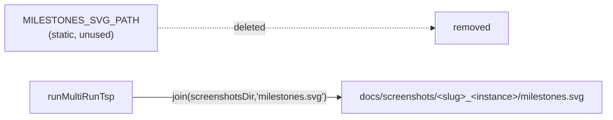

# PR Summary — Issue #628

## Summary

Removed the unused exported constant `MILESTONES_SVG_PATH` (and its JSDoc) from
`tsp_constructive/tsp_constructive.ts`. Module-graph analysis and a repo-wide search confirmed the
identifier appeared exactly once — its own declaration — with no importer in any `.ts` module and no
dynamic reference in any `.sh`/`.md`/`.json` file.

The dead constant's value was `docs/screenshots/tsp_constructive/milestones.svg`. The caveat in the
issue — "confirm no runner writes a milestones SVG via a separately-hardcoded literal that should
instead reference this constant" — was checked and cleared: the runner writes the milestone-stats
SVG via a **dynamically-constructed** path,
`docs/screenshots/${EXAMPLE_SLUG}_${instanceName}/milestones.svg` (e.g.
`tsp_constructive_burma14/milestones.svg`), which differs from the stale constant. The sibling
artefact constants `EXAMPLE_SLUG` and `SCREENSHOT_PATH` are genuinely used and remain exported.

Closes #628

## Evidence

Backend/CLI change — no web interface to screenshot. Verified via tests and the existing fast
quality gates:

- `deno fmt --check` — clean (2 files).
- `deno lint tsp_constructive/` — clean (8 files).
- `deno test --allow-all tsp_constructive/tsp_constructive_test.ts` — 9 passed, 0 failed.

## Test Plan

- Added
  `tsp_constructive/tsp_constructive_test.ts::public exports — dead
  MILESTONES_SVG_PATH is gone, used siblings remain`
  — a "what" test that dynamically imports the module and asserts `MILESTONES_SVG_PATH` is no longer
  in the export surface, while `EXAMPLE_SLUG` and `SCREENSHOT_PATH` remain. This test failed against
  the unremoved code and passes after the removal, guarding against re-introduction.
- The pre-existing test `runMultiRunTsp — persists champion + milestones and
  writes milestone SVG`
  continues to pass, confirming the real (dynamic) milestone-SVG path is unaffected.
