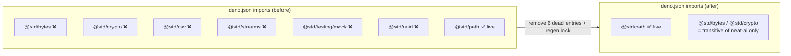

## Summary

Removed six unused `@std/*` standard-library entries from the `imports` map of `deno.json` and
regenerated `deno.lock` so the resolved module set matches the code that actually imports these
packages. Closes #647.

The removed direct entries were:

| specifier           | why removed                                                                                                                 |
| ------------------- | --------------------------------------------------------------------------------------------------------------------------- |
| `@std/bytes`        | no source file imports it                                                                                                   |
| `@std/crypto`       | no source file imports it                                                                                                   |
| `@std/csv`          | no source file imports it                                                                                                   |
| `@std/streams`      | no source file imports it                                                                                                   |
| `@std/testing/mock` | never `import`ed — only appears as quoted string fixtures in `bump_deps_test.ts` (test data for the dependency-bump parser) |
| `@std/uuid`         | no source file imports it                                                                                                   |

Each specifier was grepped across every `*.ts` file for all real import forms (`from "<name>"`,
`import "<name>"`, dynamic `import("<name>")`, `import.meta.resolve("<name>")`) and returned zero
matches. Live entries such as `@std/path`, `@std/assert` and `@stsoftware/neat-ai` are untouched.

`@std/bytes` and `@std/crypto` still appear in `deno.lock`, but now **only** as transitive
dependencies of `@stsoftware/neat-ai` — they are no longer declared as direct dependencies of this
repo, which is exactly the accuracy the issue asks for. The lockfile shrank by 66 lines.

## Evidence

Backend/config-only change — there is no web interface to screenshot. Verified via the repository's
Deno tooling:

- `deno fmt --check deno.json` — clean.
- `deno lint` — checked 168 files, no errors.
- `deno check` — passes.
- `deno test --frozen …` (full parallel suite) — **1178 passed | 0 failed**. The `--frozen` flag
  confirms the regenerated `deno.lock` is in sync with `deno.json`; a stale lock would have failed
  the run.
- `bump_deps_test.ts` (31 tests) still passes — the `@std/testing/mock` string fixtures are
  in-memory parser data and are unaffected by removing the import-map entry.

## Test Plan

No test changes were required — this is a dependency-hygiene edit with no behavioural change, and
the existing suite already exercises the affected tooling.

- Ran the full unit-test suite under `--frozen` (1178 tests) to confirm no source file relied on the
  removed entries and the lockfile stays consistent.
- Ran `bump_deps_test.ts` specifically to confirm the `@std/testing/mock` fixtures still parse after
  the import-map entry was removed.
