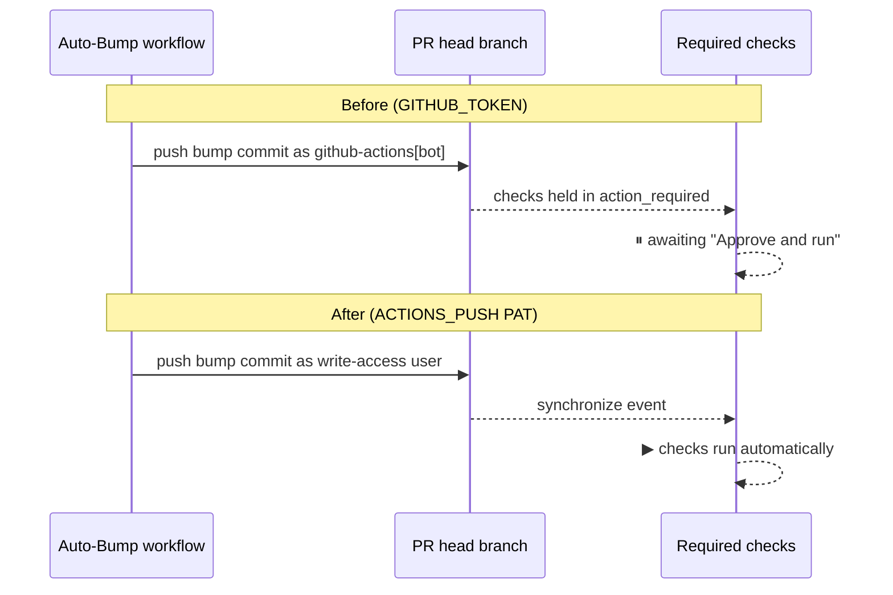

# PR Summary — Issue #651

## Summary

CI checks on this repo regularly stalled at "This workflow requires approval from a maintainer" and
needed a manual **Approve and run**, while other stSoftwareAU repos run automatically. Root cause:
the `Deno Dependency
Auto-Bump` and `Deno Security Update` workflows pushed to PR branches with
`secrets.GITHUB_TOKEN`. A `GITHUB_TOKEN` push is attributed to `github-actions[bot]`, which has no
write access, so GitHub held the resulting `pull_request` check runs in `action_required` state.

The fix switches the automation credential to the org `ACTIONS_PUSH` PAT (a write-access identity).
A PAT push is a write-access event, so the `synchronize` runs of the required checks now start
automatically — no manual approval. This makes the unreliable `workflow_dispatch` re-dispatch
workaround (#485) redundant, so it is removed along with its now-unneeded `actions: write`
permission.

Scope (converged 2026-07-02 on the issue): keep bump-on-every-PR, no weekly cron, no
org/repo-settings changes; `first_time_contributors` approval stays for genuinely external fork
contributions.

Closes #651.

### Changes

- `.github/workflows/deno-outdated.yml`
  - Check out / push with `secrets.ACTIONS_PUSH` instead of `secrets.GITHUB_TOKEN` (checkout
    persists the credential for the later `git push`).
  - Delete the `Re-dispatch required checks after bump push` step.
  - Drop the now-unneeded `actions: write` permission (keep `contents: write`).
  - Refresh the stale #485 header/step comments.
  - Keep the same-repo fork guard and the `git diff --quiet` no-change guard.
- `.github/workflows/deno-security-update.yml`
  - Check out / push the advisory branch with `secrets.ACTIONS_PUSH`.
  - Run `gh pr create` with `GH_TOKEN: secrets.ACTIONS_PUSH` so the daily security PR's checks
    trigger automatically.

## Evidence

Backend/CI change — no web interface to screenshot. Verified via the new "what" tests (parse the
workflow YAML and assert on structure) and `actionlint` (exit 0 on both workflows).

## Test Plan

- Added `deno_workflow_push_credential_test.ts`:
  - `deno-outdated checks out the PR head with the ACTIONS_PUSH PAT`
  - `deno-outdated drops the unreliable re-dispatch workaround`
  - `deno-outdated no longer requests actions: write`
  - `deno-outdated keeps the same-repo fork guard`
  - `deno-security-update checks out with the ACTIONS_PUSH PAT`
  - `deno-security-update opens its PR with the ACTIONS_PUSH PAT`
- Existing `deno_outdated_override_test.ts` still passes (quarantine override behaviour unchanged).
- `actionlint` passes on both modified workflows.
