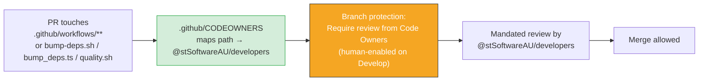

## Summary

Added `.github/CODEOWNERS` to place the repository's privileged surfaces under mandated code-owner
review, closing the governance gap flagged in issue #654. Closes #654.

The ten workflows under `.github/workflows/` run with secrets beyond the default `GITHUB_TOKEN` —
the write-capable `ACTIONS_PUSH` PAT (`deno-security-update.yml`, `deno-outdated.yml`),
`SEMGREP_APP_TOKEN` (`semgrep.yml`) and `CODECOV_TOKEN` (`quality.yml`). Without a CODEOWNERS rule
covering that path, a self-approving account could merge a workflow edit that then executes with
those secrets in scope. The supply-chain scripts (`bump-deps.sh`, `bump_deps.ts`, `quality.sh`)
carry the same blast radius and are now owned too.

**Owner team choice.** The issue suggested `@stSoftwareAU/maintainers`, but that team does not exist
in the org — an unresolvable owner makes CODEOWNERS silently non-enforcing. I used
`@stSoftwareAU/developers`, the maintaining team with push access, matching the sibling `NEAT-AI`
repo's CODEOWNERS (Issue #3187 there).

**Out of scope (repo-level GitHub settings, not committable files).** Enabling *Require review from
Code Owners* on the `Develop` branch protection rule, plus the recommended companion settings
(≥1 required approval, block direct/force-push, linear history), are GitHub configuration not visible
from the clone. These are documented as recommendations in `CONTRIBUTING.md` so a human with repo
admin can apply them.



## Evidence

Backend/config change — no web interface to screenshot. Verified via the new unit tests
(`codeowners_test.ts`), which assert on the committed CODEOWNERS artefact:

```
running 5 tests from ./codeowners_test.ts
CODEOWNERS exists under .github/ ... ok
CODEOWNERS assigns an owner to every rule ... ok
CODEOWNERS covers the privileged .github/workflows/ path ... ok
CODEOWNERS covers the supply-chain scripts ... ok
CODEOWNERS owns itself so ownership cannot be quietly changed ... ok

ok | 5 passed | 0 failed
```

## Test Plan

Added `codeowners_test.ts` (TDD — written failing first, then made green):

- `CODEOWNERS exists under .github/` — the file is present.
- `CODEOWNERS assigns an owner to every rule` — no rule is left without a team owner.
- `CODEOWNERS covers the privileged .github/workflows/ path` — the CI surface is owned.
- `CODEOWNERS covers the supply-chain scripts` — `bump-deps.sh`, `bump_deps.ts`, `quality.sh` owned.
- `CODEOWNERS owns itself so ownership cannot be quietly changed` — the CODEOWNERS file is self-owned.

Also updated `CONTRIBUTING.md` with a **Code Owners & Branch Protection** section documenting the
enforcement mechanism and the human-only branch-protection recommendations.
