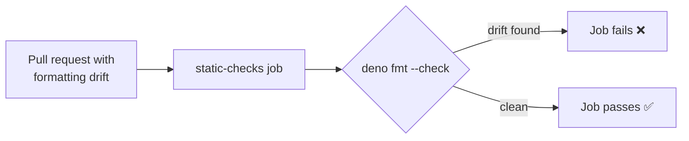

# PR Summary — Issue #663: FMT-LINT-DRIFT

## Summary

The `static-checks` job in `.github/workflows/quality.yml` ran `deno fmt` in **write mode**, which
reformats files only in the ephemeral runner and is never committed back — so committed formatting
drift passed CI unnoticed. This change switches the gate to `deno fmt --check` so drift fails the
pull-request status check, clears the one pre-existing drifted file, and adds a YAML-parsing test
that asserts the gate stays in check mode. The `deno lint` step already enforced the linter, so it
is unchanged. Closes #663.

## Changes

- **`.github/workflows/quality.yml`** — `Apply Deno formatting` (`deno fmt`) replaced by
  `Check Deno formatting` (`deno fmt --check`) in the `static-checks` job.
- **`docs/archive/pr-summaries/pr-summary-654.md`** — reformatted by `deno fmt` to clear the
  existing drift (emphasis markers `*…*` → `_…_`, a few lines re-wrapped to the configured
  `lineWidth` of 100).
- **`fmt_check_ci_test.ts`** — new test parsing the workflow YAML and asserting the fmt step runs
  with `--check`.

## Evidence

Backend/CI-config change — no web interface to screenshot. Verified locally with the Deno toolchain:

- `deno fmt --check` → `Checked 492 files` (clean, no drift).
- `deno lint` → `Checked 171 files` (clean).
- New test fails against the old `deno fmt` workflow step and passes after the `--check` change.

Before this change the step was `deno fmt` (write mode): drift was silently reformatted in the
runner, discarded, and the job passed regardless.

## Test Plan

- Added `fmt_check_ci_test.ts`:
  - `static-checks runs deno fmt in check mode` — parses the workflow and asserts the fmt step's
    `run` contains `deno fmt … --check`.
  - `static-checks does not apply formatting in write mode` — asserts the step does not run bare
    `deno fmt` (write mode).
- Both reproduce the gap: they fail against the unfixed `deno fmt` step and pass after switching to
  `deno fmt --check`.
- Existing workflow/config tests (`deno_workflow_push_credential_test.ts`, `codeowners_test.ts`)
  continue to pass.
