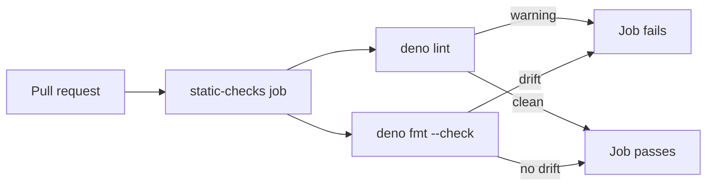
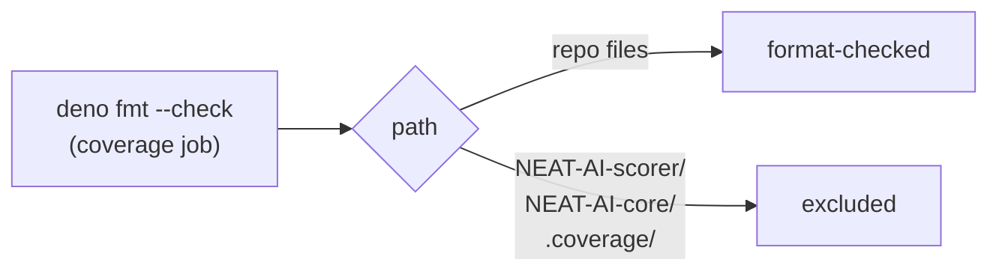

# PR Summary — Issue #663: enforce formatting drift in CI

## Summary

The CI quality gate ran the formatter in **write mode** (`deno fmt`) in the `static-checks` job, so
committed formatting drift was silently reformatted in the ephemeral runner and never failed the
pull request. This change switches the CI formatter step to **check mode** (`deno fmt --check`) so
drift now fails the PR — matching the already-enforced `deno lint` gate — and clears the one
existing drifted file. Closes #663.

Changes:

1. **Cleared existing drift** — ran `deno fmt` on `docs/archive/pr-summaries/pr-summary-654.md`
   (emphasis markers normalised `*…*` → `_…_`, a few over-long lines re-wrapped to the configured
   `lineWidth` of 100).
2. **Wired the formatter into the CI gate** — the `Apply Deno formatting` step in
   `.github/workflows/quality.yml`'s `static-checks` job is now `Check Deno
   formatting`, running
   `deno fmt --check` instead of `deno fmt`.

Local `quality.sh` intentionally keeps applying the formatter in write mode so contributors' drift
is fixed before it is committed; CI is the enforcing gate. No Node formatters/linters were
introduced — the repo stays on its native Deno toolchain.

### Enforcement flow

## Evidence

Backend/CI change — no web interface to screenshot. Verified via tests:

- Before the fix, all three new tests in `deno_fmt_check_ci_test.ts` failed (write-mode `deno fmt`
  in CI, plus committed drift in `pr-summary-654.md`).
- After the fix, all three pass, and `deno fmt --check` reports no drift across the tree.

## Test Plan

Added `deno_fmt_check_ci_test.ts`:

- `static-checks runs deno fmt in check mode` — parses `quality.yml` and asserts the formatter step
  runs `deno fmt --check`.
- `static-checks never applies the formatter in write mode` — asserts the step does not run a bare
  write-mode `deno fmt`.
- `committed tree has no deno fmt drift` — runs `deno fmt --check` and asserts a clean exit,
  guarding against future committed drift.

## CI follow-up — scope the drift check to this repo (PR #666)

The `Unit tests + coverage` CI job checks out sibling repos **inside the workspace** —
`NEAT-AI-scorer/` and `NEAT-AI-core/` — before running `deno test`, and writes the coverage profile
to `.coverage/`. The new `committed tree has no deno fmt drift` test runs `deno fmt --check` from
the repo root, so it traversed those foreign checkouts and reported drift on files this repo does
not own (`Found 183 not formatted files in 696 files`). It passed locally only because the siblings
are absent there.

Fix: extend `deno.json`'s `fmt.exclude` with `NEAT-AI-scorer`, `NEAT-AI-core`, and `.coverage` so
the formatter — in both write mode locally and `--check` in CI — only ever touches this repo's own
files. The excludes are inert when those paths are absent (local, `static-checks`), so behaviour is
unchanged everywhere except the coverage job. No Node tooling introduced; the fix stays on the
native Deno toolchain.

