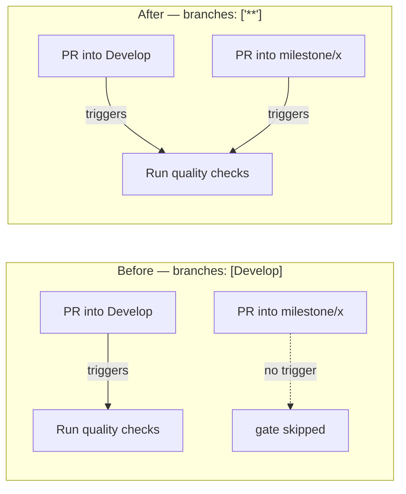

## Summary

The Quality Check workflow (`.github/workflows/quality.yml`) restricted its `pull_request` trigger
to the `Develop` branch, so it never ran on milestone sub-issue PRs — which target a shared
`milestone/<slug>` branch. Those PRs merged without the test/lint/type-check/examples gate and hung
on "Expected — waiting for status" because branch protection expects the required
`Run quality checks` context that this workflow produces.

Widened the `pull_request` branch filter to `branches: ["**"]`, matching every other PR-gating
workflow in the repository (`actionlint.yml`, `deno-audit.yml`, `shellcheck.yml`,
`markdown-lint.yml`, etc.), which were already widened for this exact reason under Issue #435. The
`["**"]` glob (not `["*"]`, which does NOT match `/`) matches base branches containing a slash, so
milestone PRs now trigger the gate. The `push` trigger stays scoped to the `Develop` default branch
— unchanged.

Closes #677.

## Evidence

This is a CI-configuration change with no web interface to screenshot. It is verified by behavioural
("what") tests that parse the workflow YAML and assert which branches trigger a run, using a minimal
emulation of GitHub's branch-glob semantics (`*` does not cross `/`, `**` does).

Branch-filter behaviour before and after:



Test run after the fix:

```
running 3 tests from ./quality_workflow_pr_branches_test.ts
pull_request triggers on milestone branch PRs ... ok
pull_request still triggers on Develop PRs ... ok
push stays scoped to the Develop default branch ... ok
ok | 3 passed | 0 failed
```

## Test Plan

Added `quality_workflow_pr_branches_test.ts`:

- `pull_request triggers on milestone branch PRs` — reproduces #677; fails against the old
  `[Develop]` filter, passes after widening to `["**"]`.
- `pull_request still triggers on Develop PRs` — guards against regressing the default-branch
  coverage.
- `push stays scoped to the Develop default branch` — confirms the `push` trigger was left unchanged
  and does not fan out to milestone branches.
