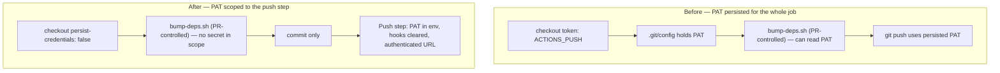

## Summary

The org `ACTIONS_PUSH` PAT was handed to `actions/checkout`, which persisted it in `.git/config` for
the whole job — including while `deno-outdated.yml` executed `bump-deps.sh`, a script taken from the
PR branch. Any same-repo PR author could have recovered the organisation's service identity with a
single `git config --get http.https://github.com/.extraheader`.

This PR keeps the credential out of the workspace and supplies it only at push time:

- `.github/workflows/deno-outdated.yml` — checkout now uses `persist-credentials: false` (no
  `token:`). The bump/commit step runs the PR-authored script with **no** secret in scope; a new
  `Push the bump commit` step receives the PAT via its own `env:` and pushes to an explicitly
  authenticated remote URL. That step clears `core.hooksPath` and `.git/hooks` first, closing the
  residual path where a PR-planted git hook could run with the PAT in the environment.
- `.github/workflows/deno-security-update.yml` — same shape applied to the secondary call-site (it
  only runs trusted `Develop` code, but consistency keeps the pattern auditable).

The #651 guarantee is unchanged: the push is still a PAT push (a write-access event), so required
checks start automatically instead of stalling in `action_required`. The #603 `workflow_dispatch`
fallback (`GITHUB_HEAD_REF` → `GITHUB_REF_NAME`) and the fork guard are preserved.

Closes #678.

## Evidence

Backend/CI-only change — no web interface to screenshot. Verified by parsing the workflow YAML in
unit tests (see Test Plan) and by `deno fmt` / `deno lint` / `./quality.sh`.

Credential scope, before and after:

## Test Plan

New — `deno_workflow_credential_scope_test.ts` (8 tests, all fail against the unfixed workflows):

- checkout in both workflows sets `persist-credentials: false` and receives no `token:`
- the step running `bump-deps.sh` has no `ACTIONS_PUSH` in scope and does not push
- a dedicated push step carries the PAT, clears `core.hooksPath`, and runs no PR-authored code
- the push step is gated on the bump having produced a commit
- across both workflows, the PAT is reachable only from `git push` / `gh pr create` steps

Modified — `deno_workflow_push_credential_test.ts` (documented business-logic change, no tests
removed): the two #651 checkout assertions moved to the push step, since the PAT deliberately no
longer reaches `actions/checkout`. The guarantee they enforce (PAT push, never `GITHUB_TOKEN`) is
unchanged; only the step it is asserted on moved.

Modified — `.github/deno_outdated_workflow_test.ts` (same documented change): the commit and the
push now live in separate steps, and the checkout no longer carries the PAT, so those two assertions
were re-pointed at the push step. No test was removed or disabled.
