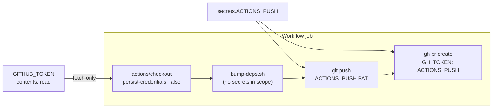

## Summary

`deno-outdated.yml` and `deno-security-update.yml` granted the job's `GITHUB_TOKEN` write scopes
that no step ever exercised. Both workflows route every write through the org `ACTIONS_PUSH` PAT by
design (#651): the branch push authenticates via an explicit PAT-bearing remote URL, and the
security-update PR is opened with `GH_TOKEN: secrets.ACTIONS_PUSH`. The unused grants widened the
blast radius of any compromised step — in `deno-outdated.yml` the job executes PR-authored
`bump-deps.sh` — for zero functional benefit, and misled reviewers into thinking `GITHUB_TOKEN` was
the write path.

Both grants are now read-only, matching every other workflow in this repo:

- `.github/workflows/deno-outdated.yml` — `contents: write` → `contents: read`
- `.github/workflows/deno-security-update.yml` — `contents: write` + `pull-requests: write` →
  `contents: read`

`GITHUB_TOKEN` is still used for the checkout fetch, which only needs `contents: read`. No
functional behaviour changes.

Closes #679.

## Evidence

This is a CI-configuration change with no web interface, so no screenshot applies. The evidence is
the test suite: four new "what" tests parse the workflow YAML and assert the least-privilege grant,
plus a cross-check that no step reachable from `GITHUB_TOKEN` performs a `git push` or
`gh pr create`.

Write paths before and after the change — unchanged, because they never used `GITHUB_TOKEN`:

Local verification (`< /dev/null` throughout):

- `deno fmt` — clean
- `deno lint` — 498 files checked, clean
- `deno check ./**/*.ts` — clean
- `deno test --parallel ...` — **1212 passed, 0 failed**
- `actionlint .github/workflows/deno-outdated.yml .github/workflows/deno-security-update.yml` —
  clean

## Test Plan

**Added** — `deno_workflow_permission_scope_test.ts` (new, 5 tests):

- `deno-outdated grants GITHUB_TOKEN read-only contents`
- `deno-outdated grants no write scope at all`
- `deno-security-update grants GITHUB_TOKEN read-only contents`
- `deno-security-update no longer requests pull-requests: write`
- `no step in either workflow uses GITHUB_TOKEN for a write` — walks every step and asserts that any
  step whose `env`/`with`/`run` surface mentions `GITHUB_TOKEN` performs neither `git push` nor
  `gh pr create`

All five failed against the unfixed workflows (except the last, which was already true) and pass
after the change.

**Modified — documented business-logic change.** Three existing tests encoded the now-obsolete
assumption that the write grants were required. No test was removed or commented out; each keeps its
original intent and coverage, with the permission assertion updated to the least-privilege value and
an inline comment recording the change:

- `.github/deno_outdated_workflow_test.ts` — `auto-bump job requests contents:write so it can push`
  → asserts `contents: read`, renamed to `auto-bump job grants GITHUB_TOKEN read-only contents`. The
  push has ridden the PAT since #651, so the write grant was never the mechanism.
- `.github/deno_security_update_workflow_test.ts` — the "write permissions to push and open a PR"
  test now asserts `contents: read` and no `pull-requests` key, renamed to
  `runs on ubuntu-latest with read-only GITHUB_TOKEN permissions`. The `runs-on: ubuntu-latest`
  assertion is unchanged.
- `deno_workflow_push_credential_test.ts` — `deno-outdated no longer requests actions: write` kept
  its original `actions` assertion; its incidental `contents === "write"` check became
  `contents === "read"`.

**Unchanged and still passing** — `deno_workflow_credential_scope_test.ts` (8 tests, #678) confirms
the PAT still reaches only the push and PR-creation steps, so this narrowing did not disturb the
credential-scoping guarantees.

## Security self-check

- [x] No secrets staged — only `.github/workflows/*.yml` (permitted) and test files
- [x] Change strictly reduces privilege; no new input, injection surface, or dependency
- [x] Both jobs keep working: reads use `GITHUB_TOKEN`, writes already ride the PAT
