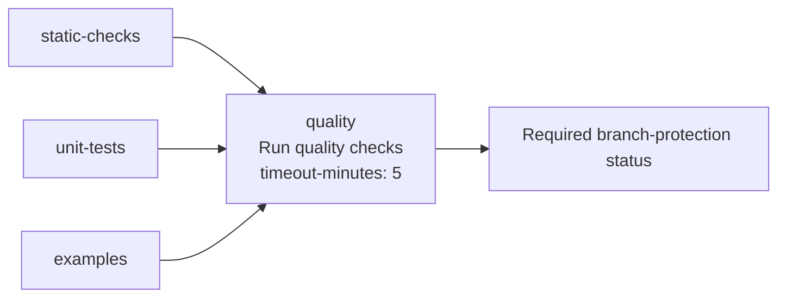

# Add `timeout-minutes` to the aggregate `quality` job

## Summary

The `quality` aggregate job (`name: Run quality checks`) in
`.github/workflows/quality.yml` declared no job-level `timeout-minutes`, so it
inherited GitHub's 360-minute default. Every other job across the repository's
workflows already carries one — this was the single job that missed it.

Because `quality` is the required `Run quality checks` branch-protection
context, a wedged runner could occupy a slot for six hours and hang every PR
queued behind it on "Expected — waiting for status". The job only compares three
`needs` results, so a small bound is ample: added `timeout-minutes: 5`.

Closes #680.

## Evidence

This is a CI-configuration change with no web interface to screenshot. It is
verified by parsing the workflow YAML and asserting on each job's effective
timeout bound.

Before: the `quality` job had no `timeout-minutes` → inherited the 360-minute
default. After: `timeout-minutes: 5` bounds a hung aggregate gate so it fails
fast instead of blocking the required status for six hours.

## Test Plan

Added `quality_workflow_job_timeout_test.ts` (new file), following the existing
`quality_workflow_pr_branches_test.ts` "what test" convention — it parses the
committed workflow YAML rather than grepping source text:

- `every job declares a positive timeout-minutes` — reproduces the bug (failed
  on the unpatched `quality` job) and guards every job going forward.
- `the aggregate quality job has a small timeout bound` — asserts the `quality`
  job carries a small, positive bound (`<= 15`).

Both tests fail against the unfixed workflow and pass after the change.
`deno fmt --check`, `deno lint`, and `actionlint` all pass.
