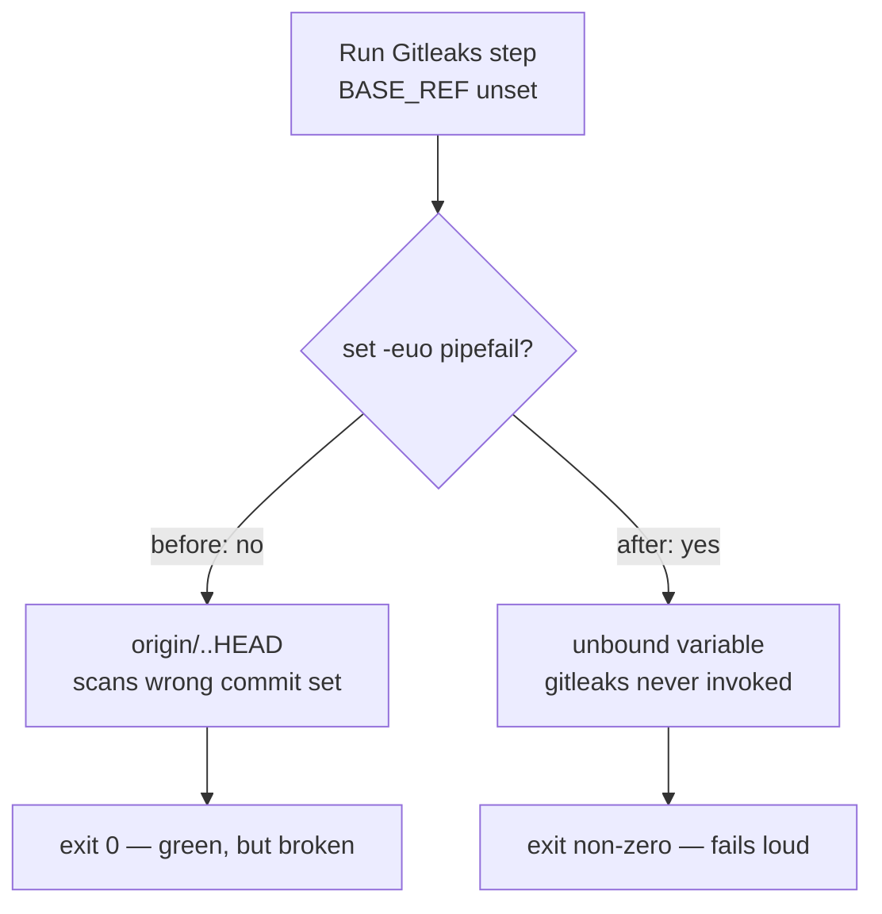

## Summary

Both multi-line `run:` blocks in `.github/workflows/gitleaks.yml` — **Install Gitleaks** and **Run
Gitleaks** — now open with `set -euo pipefail`, matching the sibling `actionlint.yml` install block
that the workflow header cites as its pattern. Closes #681.

GitHub's default shell for a `run:` step is `bash -e {0}` — `errexit` only. Without `-u` an unset
variable expands silently to an empty string, so a renamed or missing `BASE_REF` would turn the scan
range `origin/${BASE_REF}..HEAD` into `origin/..HEAD` and quietly scan the wrong commit set instead
of failing loudly. Without `pipefail`, a failure on the left of any future pipeline is masked by the
exit status of the last command. Both are silent-failure classes; the guard makes them loud.

## Evidence

Workflow/CI change — no web interface to screenshot. Behaviour is verified by executing the
workflow's own `run:` scripts the way the runner does (`bash -e`), with stub binaries in a temp
directory.

Before → after for the failure the guard closes:



Test run against the fixed workflow:

```text
running 6 tests from ./.github/gitleaks_workflow_test.ts
gitleaks workflow — no run: step interpolates ${{ ... }} directly ... ok
gitleaks workflow — Run Gitleaks step passes base_ref via env: ... ok
gitleaks workflow — every multi-line run: block enables strict mode ... ok
gitleaks workflow — Run Gitleaks aborts instead of scanning when BASE_REF is unset ... ok
gitleaks workflow — Run Gitleaks still scans when BASE_REF is set ... ok
gitleaks workflow — Install Gitleaks completes under strict mode ... ok

ok | 6 passed | 0 failed
```

The two new behavioural tests were written first and both failed against the unguarded workflow
(`must start with 'set -euo pipefail' … got first line:
"GITLEAKS_VERSION="8.30.1""` and
`step must fail loudly when BASE_REF is unset,
but it exited 0`), confirming they reproduce the
reported defect.

## Test Plan

Four tests added to `.github/gitleaks_workflow_test.ts`:

- `every multi-line run: block enables strict mode` — parses the workflow and asserts each
  multi-line `run:` opens with `set -euo pipefail`.
- `Run Gitleaks aborts instead of scanning when BASE_REF is unset` — regression test for the defect:
  executes the step's real script under `bash -e` with a stub `gitleaks` binary and no `BASE_REF`;
  asserts a non-zero exit and that the stub was never invoked.
- `Run Gitleaks still scans when BASE_REF is set` — the guard must not break the happy path; asserts
  exit 0 and that `gitleaks` receives `origin/Develop..HEAD`.
- `Install Gitleaks completes under strict mode` — runs the install script with stub `curl`/`tar`;
  asserts exit 0 and an executable `gitleaks` on disk, so `nounset` does not break a working
  download.

All 95 tests under `.github/` pass, plus repo-wide `deno fmt --check`, `deno lint`, and `deno check`
on the modified test file.
