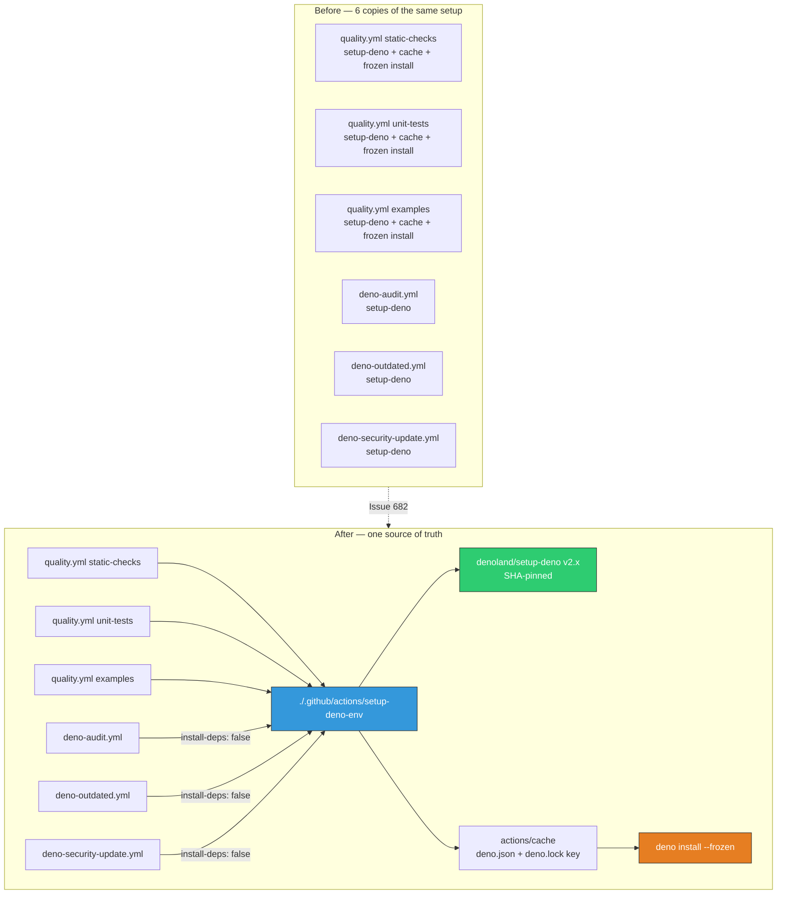
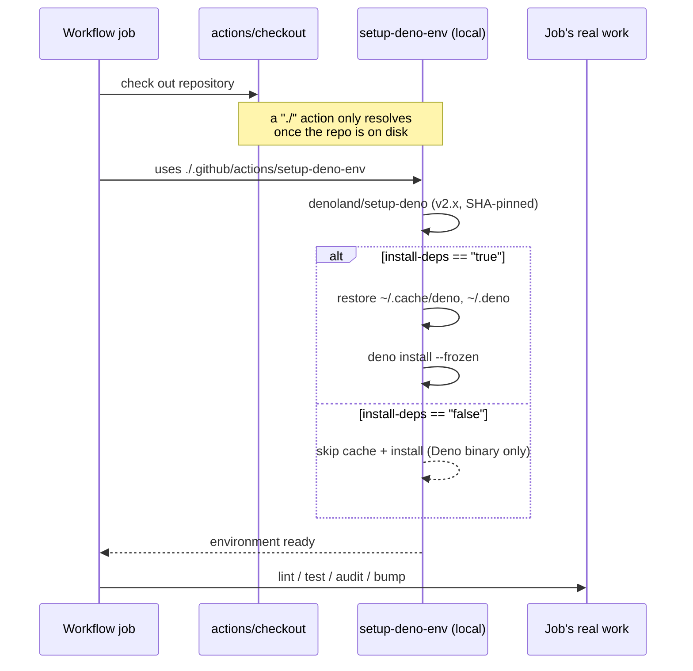

# Extract the copy-pasted Deno setup into a composite action

## Summary

The checkout + `denoland/setup-deno` pair — and, in `quality.yml`, the identical `actions/cache` +
`deno install --frozen` block — was copy-pasted across **six job bodies in four workflows**. Every
Deno version-policy change, cache-key tweak, or manual SHA re-pin (done by hand under the 24h
supply-chain quarantine) had to touch all six copies, and drift between them was silent: a job
quietly caching differently or lagging a pin would fail nothing.

This PR collapses the version pin, the cache recipe, and the frozen-install policy into one local
composite action, `.github/actions/setup-deno-env`. Checkout necessarily stays in each job — a local
`./` action is unresolvable until the repository is on disk. Closes #682.

### What changed

- **New** `.github/actions/setup-deno-env/action.yml` — installs Deno (single `v2.x` pin behind a
  `deno-version` input) and, when `install-deps` is `"true"` (the default), restores the Deno
  dependency cache and runs `deno install --frozen`.
- **Six inline blocks replaced.** `quality.yml`'s three parallel jobs take the default
  (`install-deps: "true"`, preserving the #418 frozen-lockfile guarantee). `deno-audit.yml`,
  `deno-outdated.yml` and `deno-security-update.yml` pass `install-deps: "false"` — the audit
  resolves the locked tree itself and the two bump channels _rewrite_ the lockfile, so a pre-emptive
  frozen install would fail on exactly the drift they exist to fix.
- **`.github/actions/` added to CODEOWNERS.** The action now runs inside those jobs with the same
  secrets in scope (`ACTIONS_PUSH`, `CODECOV_TOKEN`). Leaving it unowned would reopen the
  poisoned-pipeline path the `/.github/workflows/` rule closes, by putting privileged CI code one
  directory outside the gate.
- **Net effect:** `quality.yml` loses 58 lines; the Deno version pin, cache key and install policy
  now exist in exactly one file.

**Supply-chain posture is unchanged.** Local `./` references are this repository's own code — there
is no upstream to re-point, so there is nothing to pin, and GitHub resolves them from the commit
already checked out. The third-party actions _inside_ the composite action remain pinned to
40-character commit SHAs, now asserted by a dedicated test.

## Evidence

This is a CI-configuration change with no web interface, so there is no screenshot to capture. The
evidence is the test suite plus a clean `actionlint` and `./quality.sh` run.

### Before → after

### Per-job step sequence

### Verification

- `actionlint .github/workflows/*.yml` — clean, no findings.
- `./quality.sh` — `Deno Format`, `Deno Lint`, `Deno Type Check`, `Unit Tests (parallel)`, the MNIST
  integration tests and every example stage reported `SUCCESS`.
- `markdownlint-cli2 README.md CONTRIBUTING.md` — 0 errors.

## Test Plan

**New** — `.github/setup_deno_env_action_test.ts` (11 tests, all failing before the action existed):

- the composite action exists, parses, and declares `using: composite` with a name and description;
- the Deno version pin lives behind a `deno-version` input defaulting to `v2.x`, and `setup-deno`
  reads it from that input rather than a second hard-coded pin;
- `install-deps` defaults to `"true"` and gates **both** the cache and the install step;
- the install passes `--frozen`, so lockfile/import-map drift fails loudly (#418) rather than being
  silently rewritten;
- the cache covers `~/.cache/deno` + `~/.deno`, keys on `deno.json` + `deno.lock`, and declares a
  `restore-keys` fallback;
- every composite `run` step declares `shell: bash` (GitHub rejects the action otherwise);
- every third-party `uses:` inside the action pins a 40-character commit SHA;
- **every** Deno job in all four workflows reaches Deno through the action, and does so _after_ its
  checkout;
- no workflow re-declares `denoland/setup-deno` or the Deno cache block inline;
- each job requests the install policy its work actually needs;
- `denoland/setup-deno` is pinned in **exactly one** place across the whole repository — this is the
  regression test for the issue: re-introducing an inline copy in any workflow fails the build.

**New** — `codeowners_test.ts::CODEOWNERS covers the privileged .github/actions/ path` — fails
against the unfixed CODEOWNERS and passes after the rule is added.

**Modified (business-logic change, documented in-file — no test was removed or disabled):**

- `.github/quality_workflow_test.ts`, `.github/deno_audit_workflow_test.ts`,
  `.github/deno_security_update_workflow_test.ts` — the "every `uses:` pins a 40-char commit SHA"
  tests now skip `./`-prefixed references _after asserting the referenced `action.yml` actually
  exists_, so an unpinned third-party action still fails and a dangling local reference is caught.
  Pinning coverage for the action's own dependencies moved to the new test file.
- `.github/quality_workflow_test.ts::every work job preserves the bump-aware checkout ref and frozen
  install`
  — the frozen install moved into the shared action, so the test now asserts the effective policy
  (the job uses the action with `install-deps` not disabled) instead of a step name. The #418
  guarantee it protects is unchanged.

All 180 tests in `.github/` and the root `*_test.ts` suites pass.
