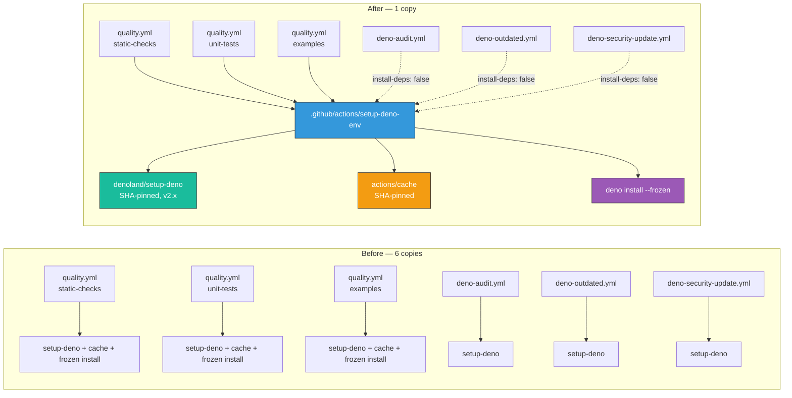

## Summary

Extracted the copy-pasted Deno environment setup into one local composite action,
[`.github/actions/setup-deno-env`](../../../.github/actions/setup-deno-env/action.yml). The
`denoland/setup-deno` call — and, in `quality.yml`, the identical `actions/cache` +
`deno install --frozen` block — was duplicated across six job definitions in four workflows, so the
Deno version policy, the cache key recipe, and two manually-bumped SHA pins each had six edit sites.
Drift between copies failed nothing: a job quietly caching differently, or lagging a pin, was
invisible. Closes #682.

The action takes two inputs:

| Input          | Default | Purpose                                                                     |
| -------------- | ------- | --------------------------------------------------------------------------- |
| `deno-version` | `v2.x`  | Repository-wide Deno release line.                                          |
| `install-deps` | `true`  | Restore the shared dependency cache and run `deno install --frozen` (#418). |

The three `quality.yml` work jobs take the default (cache + frozen install). `deno-audit.yml`,
`deno-outdated.yml`, and `deno-security-update.yml` pass `install-deps: "false"` — they need the
Deno binary alone, since `deno audit --frozen` and `bump-deps.sh` resolve their own dependencies.
`actions/checkout` deliberately stays in every job: a local `./` action is only resolvable once the
repository is on disk.

Net effect: 66 lines of duplicated workflow YAML removed, and one edit site for the version pin,
cache key, and wrapped SHA pins.

### Documented business-logic changes to existing tests

No test was removed or commented out. Three were widened, each with an in-file comment explaining
why:

1. **SHA-pin tests** (`quality_workflow_test.ts`, `deno_audit_workflow_test.ts`,
   `deno_security_update_workflow_test.ts`) now skip `uses:` values beginning with `./`. A local
   composite action lives in this repository, so there is no upstream ref to pin. Coverage is not
   lost — the pins the action wraps are asserted by the new `.github/setup_deno_env_action_test.ts`,
   which fails if either becomes unpinned.
2. **`quality workflow — every work job preserves the bump-aware checkout ref and frozen install`**
   previously required a step literally named `Install dependencies with frozen lockfile`. That step
   moved into the composite action, so the test now accepts the guarantee delivered either inline or
   through the action (which installs by default). The guarantee itself — every work job reaches a
   frozen install — is unchanged.
3. **CODEOWNERS** gained `/.github/actions/`, with a matching test in `codeowners_test.ts`. The
   workflows `uses:` these actions, so an edit there executes on the runner with the same secrets in
   scope as a workflow edit — same blast radius, same required reviewers (Issue #654's rationale).

## Evidence

This is a CI-configuration change with no web interface, so there is no screenshot to capture. The
evidence is the passing test suite plus `actionlint`, which validates the rewritten workflows.

### Before → after



### Command output

```text
$ deno test --parallel --frozen --no-check … --ignore=mnist_classification/evolve_integration_test.ts
ok | 1231 passed | 0 failed (27s)

$ deno fmt --check
Checked 506 files

$ deno lint
Checked 178 files

$ actionlint          # validates every rewritten workflow
(exit 0, no findings)

$ npx markdownlint-cli2@0.22.1 README.md
Summary: 0 error(s)
```

TDD order: the nine tests in `.github/setup_deno_env_action_test.ts` were written and run first —
all nine failed against the unrefactored tree (`FAILED | 0 passed | 9 failed`) — and pass after the
action and workflow edits.

> [!NOTE]
> A full `./quality.sh` run hit one **pre-existing, unrelated flake** in its unit-test section:
> `lunar_lander_test.ts::scoreController with perturbation varies the pad position across trials`.
> That test scores an unseeded random `Creature` (`new Creature(INPUT_COUNT, OUTPUT_COUNT)`), so the
> spread it asserts on is stochastic; it passed 3/3 on re-run and 1231/1231 in the standalone suite
> above. This change touches no runtime code — only `.github/`, `README.md`, and workflow tests — so
> it cannot affect that example. Left alone as out of scope for this issue.

### Security self-check

- **Supply chain**: no new third-party action. The two wrapped actions keep their existing
  40-character SHA pins, now asserted in a single test. Local `./` references add no supply-chain
  surface — they resolve to this repository's own tree.
- **Execution surface**: `deno-audit.yml` previously ran no repository code on a pull request; it
  now loads the local action from the checked-out PR head, as `quality.yml` already does. That job
  holds no secrets and runs with `permissions: contents: read`, so the blast radius is unchanged in
  practice. `.github/actions/` is now CODEOWNERS-owned so a change there requires a maintainer
  review, matching `.github/workflows/`.
- **Secrets**: no secret is read by the composite action, and none was staged. `ACTIONS_PUSH`
  remains scoped to the dedicated push steps (#678).
- **Least privilege**: no workflow permission block was changed.

## Test Plan

Added `.github/setup_deno_env_action_test.ts` — nine "what" tests that parse the action and workflow
YAML and assert on structure:

- `the composite action exists and parses` — file present, `using: composite`, name + description.
- `exposes deno-version and install-deps inputs with documented defaults` — `v2.x` / `true`, every
  input documented.
- `installs Deno at the requested version` — the version comes from the input, not a hard-coded pin.
- `cache and frozen install are gated on install-deps` — cache path/key/restore-keys, the `--frozen`
  install, both `if:`-gated, and every composite `run:` step names a shell (GitHub rejects the
  action otherwise, which would break every workflow).
- `every wrapped action pins a 40-char commit SHA` — replaces the coverage the workflow-level tests
  now delegate.
- `no workflow installs Deno directly` — regression test for the duplication this issue removes.
- `every Deno job reaches Deno through the composite action` — expected job counts per workflow, and
  a checkout precedes the local action in each.
- `the quality work jobs install dependencies through the action` — the frozen install (#418) is
  preserved for all three.
- `the Deno version pin and cache key live in exactly one file` — no workflow may reintroduce a
  `deno-version:` or a `deno-` cache key.

Modified (widened, not removed — see above):

- `.github/quality_workflow_test.ts`, `.github/deno_audit_workflow_test.ts`,
  `.github/deno_security_update_workflow_test.ts` — exempt local `./` action references from the
  SHA-pin rule.
- `.github/quality_workflow_test.ts` — accept the frozen install via the composite action.
- `codeowners_test.ts` — new `CODEOWNERS covers the local composite actions` test.

Documentation: README gained a **Shared Deno environment setup** section with a Mermaid diagram and
a usage snippet.
