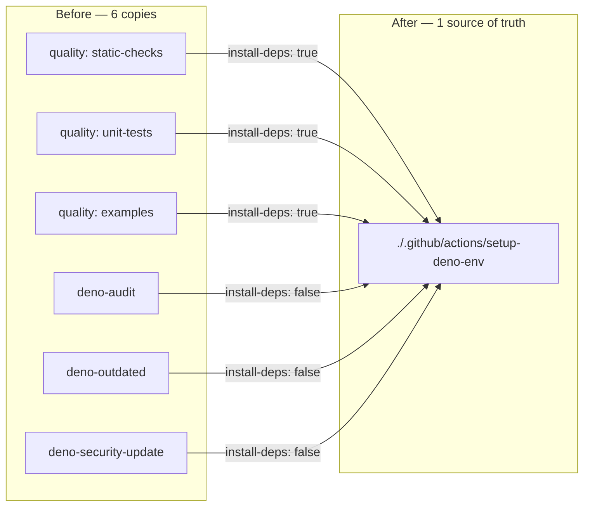

# Extract the shared Deno environment setup into a composite action (Issue #682)

## Summary

The checkout + `denoland/setup-deno` pair (same SHA pins, `deno-version: v2.x`)
was copy-pasted across four workflows, and `quality.yml` additionally repeated
the identical dependency cache + `deno install --frozen` block in each of its
three parallel jobs — six copies of the same setup, six places to update on any
Deno-version / cache-key / SHA-pin change, and silent drift if one copy lagged.

This PR extracts a **local composite action**,
`.github/actions/setup-deno-env/action.yml`, that always installs Deno (pinned
SHA, `deno-version: v2.x`) and — behind the `install-deps` input — optionally
restores the Deno dependency cache and runs `deno install --frozen`. Each
duplicated block collapses to:

```yaml
- name: Set up Deno environment
  uses: ./.github/actions/setup-deno-env
  with:
    install-deps: "true"   # omitted/false for the Deno-only workflows
```

- `quality.yml` — all three work jobs (`static-checks`, `unit-tests`,
  `examples`) pass `install-deps: "true"`.
- `deno-audit.yml`, `deno-outdated.yml`, `deno-security-update.yml` — Deno
  runtime only, so they rely on the default `install-deps: "false"` (no cache,
  no frozen install).

Checkout stays inline in every job, because a local `./` action is only
resolvable after the repository is checked out. Local `./` references are exempt
from the 40-char SHA-pinning rule; the third-party actions the composite wraps
stay SHA-pinned in the single source of truth, so no supply-chain surface is
added.

Closes #682.

## Evidence

Workflow/CI change only — no web interface to screenshot. Verified via the new
and updated YAML-structure tests plus repo-wide `deno fmt --check`, `deno lint`,
and `deno check`, and a clean local `actionlint` run.



## Test Plan

New — `.github/setup_deno_env_action_test.ts`:

- composite action parses and declares `runs.using: composite`;
- `install-deps` input defaults to `false`;
- Deno install is unconditional, SHA-pinned, `deno-version: v2.x`;
- cache + `deno install --frozen` are both gated on
  `inputs.install-deps == 'true'`, with the cache key hashing
  `deno.json` + `deno.lock`;
- all four consumer workflows reference `./.github/actions/setup-deno-env` and
  none inline `denoland/setup-deno`;
- the three Deno-only workflows do not request `install-deps: "true"`.

Updated:

- `.github/quality_workflow_test.ts` — the SHA-pin loop now skips local `./`
  refs; the per-work-job assertion checks each job invokes the composite action
  with `install-deps: "true"` (replacing the check for the inline
  "Install dependencies with frozen lockfile" step, which moved into the
  action).
- `.github/deno_audit_workflow_test.ts`,
  `.github/deno_security_update_workflow_test.ts` — SHA-pin loops skip local
  `./` refs.

All 97 tests under `.github/` pass.
