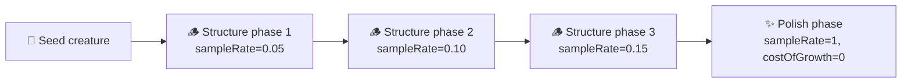

# Reword private-repo campaign mentions in `stock_market` to concept level

## Summary

The `stock_market/` example named a private production repository throughout its
exploration-campaign pipeline — README prose and section heading, the shell entry point's comment
and echoed banner, module doc comments, the CLI banner, and the test-suite doc comment. That
repository is private, so the pointer resolves to nothing for a public reader while the campaign
design itself is perfectly good public content.

Every mention is reworded to concept level — a **phased exploration campaign**: structure-discovery
phases on escalating training subsamples with low `costOfGrowth`, followed by a weight-polish phase
on full data with `costOfGrowth = 0`. The README's phrase naming the private repository's
market-prediction use case becomes "a production market-prediction system we operate elsewhere".
Wording only — no identifiers renamed, no behaviour changed. Closes #694.

| File                           | Before                                                                    | After                                                                              |
| ------------------------------ | ------------------------------------------------------------------------- | ---------------------------------------------------------------------------------- |
| `README.md` (l.10)             | a phrase naming the private repository's market-prediction use case       | "a production market-prediction system we operate elsewhere"                       |
| `README.md` (l.210)            | a section heading naming the private repository                           | "🧭 Phased Exploration Campaign"                                                   |
| `README.md` (l.216)            | "mirroring the … sampler pattern", naming the private repository          | "mirroring the phased sampler pattern we use on production market-prediction work" |
| `exploration_campaign.sh`      | comment + banner describing the campaign by the private repository's name | "phased exploration campaign"                                                      |
| `exploration_campaign.ts`      | doc comments describing the campaign and sampler pattern by that name     | "Phased exploration campaign", "the phased sampler pattern"                        |
| `exploration_campaign_cli.ts`  | module doc + printed banner naming the private repository                 | "phased exploration campaign"                                                      |
| `exploration_campaign_test.ts` | test-suite doc comments describing the campaign and pattern by that name  | "phased exploration campaign", "mirrors the phased sampler pattern"                |

No anchor links pointed at the renamed README heading, so no cross-references needed updating. The
remaining repo-wide mentions of the private repository (`bump-deps.sh`, `common/*.sh`) are outside
this issue's scope.

## Evidence

No web interface to screenshot — this is a documentation and console-output rewording in a CLI
example. Verified instead by:

- A case-insensitive grep for the private repository's name across `stock_market/` returns no
  matches.
- `./stock_market/exploration_campaign.sh --fast` runs end-to-end and prints the reworded banners:

  ```text
  📈 Stock Market — phased exploration campaign

  🧬 Stock Market — phased exploration campaign (issue #476)
     working dir : .synthetic-stock/exploration
     promote     : (disabled — pass --promote)
     squash scan : off
     fast mode   : yes
     prices      : 1865 points (1871-01-01 → 2026-05-01)
     split       : train=1297 val=278 test=279
  ▶ Phase 1/2 structure-fast sampleRate=0.1 costOfGrowth=0.000001 gens<=5 timeout=1m
  ```

- `deno fmt --check`, `deno lint`, and `deno check ./**/*.ts` pass.
- `markdownlint-cli2 stock_market/README.md` — 0 errors.
- `bash -n stock_market/exploration_campaign.sh` passes; `shellcheck` reports only the pre-existing
  SC1091 info about the shared preamble `source` (identical on the untouched `stock_market/run.sh`).

The pipeline the wording now describes is unchanged:



## Test Plan

No behaviour change, so no new tests — the existing suite runs unchanged and still asserts the same
outcomes. Only doc comments moved in the test file; no test was removed, skipped, or weakened.

- `deno test stock_market/` — **60 passed, 0 failed**, covering
  `stock_market/exploration_campaign_test.ts` (`runExplorationCampaign` phase execution, empty-phase
  and out-of-range `trainingSampleRate` rejection, `promoteExplorationArtefacts`),
  `stock_market/stock_market_test.ts`, and `stock_market/data_test.ts`.
- `stock_market/stock_market_test.ts::README embeds the multi-run charts and drops the legacy
  evolution_summary path`
  passes, confirming the edited README still satisfies its assertions.
