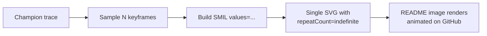

# Animate the example screenshots (issue #70)

## Summary

Replaced the static example-screenshot SVGs with SMIL-animated SVGs so the README illustrations
actually show what is happening rather than freezing a moment in time. All three screenshots —
`cart_pole.svg`, `lunar_lander.svg`, and `xor_decision_boundary.svg` — now carry `<animate>`
elements that loop indefinitely, and GitHub renders SMIL natively in `` tags so the animations
play directly in the rendered README. Closes #70.

## What changed

- **`cart_pole/svg.ts`** — replaced the eight-frame static strip (1440 × 220) with a single 480 ×
  320 animated frame. The cart's `x` and the pole's `x1`/`x2`/`y2` endpoints carry `<animate>`
  keyframe lists sampled from the full champion trace, so the cart slides and the pole oscillates
  through the recorded run. A small progress bar sweeps left-to-right each loop. Default keyframe
  count bumped from 8 to 60 for smooth motion.
- **`lunar_lander/svg.ts`** — kept the existing static pose markers (start/mid/end) for
  accessibility, and added an `animated-lander` group whose hull circle and main-thruster flame
  travel along the recorded trajectory. Up to 80 keyframes are sampled. The flame's `opacity`
  toggles discretely (1/0) so it visibly flickers when the controller fires.
- **`xor_classification/svg.ts`** — each of the four sample markers now has a pulsing radius
  animation plus an outer ring that fades outward, with the four pulses staggered by quarter-cycle
  offsets so the eye is led around the XOR truth-table corners.

The committed `docs/screenshots/*.svg` files were regenerated by the existing `run.sh` scripts and
now include 6, 7, and 12 `<animate>` elements respectively, all with `repeatCount="indefinite"`.

## Test Plan

- Updated tests in `cart_pole/cart_pole_test.ts` —
  `renderRunSVG emits an <svg> root with SMIL animation elements` (was
  `... with the expected number of frame groups`) now asserts on `<animate>` element count and
  verifies the cart-x keyframe list length matches the requested sample count. Added
  `renderRunSVG repeats the animation indefinitely`.
- Added test in `lunar_lander/lunar_lander_test.ts` —
  `renderRunSVG embeds SMIL animation elements that loop`.
- Added test in `xor_classification/xor_classification_test.ts` —
  `renderDecisionBoundarySVG embeds SMIL pulse animations on each sample`.

The cart-pole frame-group test was rewritten (not removed) because the business logic changed: there
is no longer a multi-frame strip layout, so asserting on `<g class="frame">` count would no longer
be a valid "what" test. The replacement asserts on the new behaviour (animation elements with the
correct keyframe count).

`./quality.sh` passes cleanly:

- Deno Lint, Deno Format Check, Deno Type Check — all SUCCESS
- Unit Tests — 79+ passing including the new animation tests
- All seven example runners (Intelligent Design, Discovery, Crossover, Cart-Pole, Lunar Lander, XOR
  Classification, Suggest Improvements) succeed and regenerate the committed SVGs.

## Evidence

This is a CLI/SVG-rendering change with no web UI. Evidence is the generated SVG content itself plus
the new "what" tests asserting on the animation primitives. Quick check:

```text
$ grep -c '<animate' docs/screenshots/*.svg
docs/screenshots/cart_pole.svg:6
docs/screenshots/lunar_lander.svg:7
docs/screenshots/xor_decision_boundary.svg:12
```


