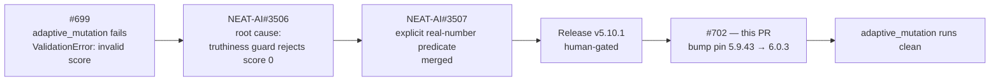

# Bump @stsoftware/neat-ai to 6.0.3 — FineTunePopulation zero-score fix

## Summary

`./adaptive_mutation/run.sh` failed deterministically on `@stsoftware/neat-ai@5.9.43` (#699).
The root cause was upstream: `FindTunePopulation.make` guarded its score comparisons with a
**truthiness** test, so a population member with a legitimate score of exactly `0` was rejected as
`ValidationError: Creature <uuid> has invalid score` and aborted the run. `adaptive_mutation`
configures `costOfGrowth: 0`, making the score `1 - error`, so an error of exactly `1` yields
exactly `0`.

The upstream fix (stSoftwareAU/NEAT-AI#3506 / PR
[#3507](https://github.com/stSoftwareAU/NEAT-AI/pull/3507)) was merged and released in
`v5.10.1`. This PR performs the ordinary dependency bump that was blocked on that human-gated
release, taking the pin to the current latest, `6.0.3`, via `./bump-deps.sh`.

Closes #702.

### Notes

- **No cross-repo change here** — the upstream fix already shipped; this repo only consumes it.
  The pin moves to a released version, not a commit/git-ref or pre-release.
- **`6.0.x` major bump**: upstream `v6.0.0` was a dead-code removal (NEAT-AI#3536). Nothing this
  repo imports was removed — `deno check` over every tracked `*.ts` passes unchanged.
- **Deno regression avoided**: the bump went through the repo's Deno-native `./bump-deps.sh`
  (which honours `deno.json`'s `minimumDependencyAge`, with internal `@stsoftware/*` at 0h and
  external pins held to the 24h floor). No npm/Node tooling was introduced.
- Only `@stsoftware/neat-ai` moved; every `@std/*` pin was held back by the 24h quarantine window
  and is unchanged.

## Evidence

This is a CLI/library change with no web interface, so no screenshot applies. The evidence is the
example that previously failed now running to completion.

**Before — `@stsoftware/neat-ai@5.9.43`:**

```
error: Uncaught (in promise) ValidationError: Creature a9cd33cb-c865-5b6d-ae7f-d2a2e1c2efd8 has invalid score
    at FindTunePopulation.make (https://jsr.io/@stsoftware/neat-ai/5.9.43/src/blackbox/FineTunePopulation.ts:101:17)
    at Module.evolve (https://jsr.io/@stsoftware/neat-ai/5.9.43/src/NEAT/NeatEvolution.ts:524:35)
    at async Module.evolveDir (https://jsr.io/@stsoftware/neat-ai/5.9.43/src/creature/CreatureTraining.ts:542:20)
```

**After — `@stsoftware/neat-ai@6.0.3`:**

```
🖼️  Wrote docs/screenshots/adaptive_mutation.svg
📈 Wrote evolution summary docs/screenshots/adaptive_mutation/evolution_summary.svg
💾 Saved champion to .adaptive-mutation/creatures/champion.json

🏁 Final: error=0.06250  score=0.9375  neurons=11  synapses=29
🕒 Completed in 1m 18s 124ms
```

The refreshed `docs/screenshots/adaptive_mutation.svg` and
`docs/screenshots/adaptive_mutation/evolution_summary.svg` artefacts from that successful run are
included in this PR.

### Unblocking chain



## Test Plan

- **Added `neat_ai_zero_score_floor_test.ts`** — a regression guard that parses `deno.json` and
  `deno.lock` and asserts the resolved `@stsoftware/neat-ai` version is at or above `5.10.1`, the
  release carrying the zero-score fix. Both cases **fail against the unfixed `5.9.43` pin** and
  pass on `6.0.3`:

  ```
  # with the 5.9.43 pin restored
  AssertionError: deno.json pins @stsoftware/neat-ai@5.9.43, which predates 5.10.1 …
  AssertionError: deno.lock resolves @stsoftware/neat-ai to 5.9.43, which predates 5.10.1 …
  FAILED | 0 passed | 2 failed

  # on 6.0.3
  ok | 2 passed | 0 failed
  ```

  These are "what" tests per `AGENTS.md`: the pinned dependency set is the deliverable, so they
  parse the config and assert on the resolved version rather than grepping source text — the same
  shape as the existing `deno_config_exclude_test.ts`.

- `deno check` over every tracked `*.ts` — clean against `6.0.3`, confirming the `v6.0.0`
  dead-code removal took nothing this repo imports.
- `./adaptive_mutation/run.sh` — the previously failing example, now completing (output above).
- `./quality.sh` — full gate (lint, format, unit tests, every example) passes.

## Security Self-Check

- **Input validation**: no new external-input surface; the added test only reads two tracked
  in-repo config files.
- **Secrets**: no credentials or hidden files staged.
- **Injection surface**: no new shell, SQL, filesystem, or HTTP calls.
- **Dependencies**: `@stsoftware/neat-ai` is an internal `stSoftwareAU/*` package pinned to an
  exact released version and recorded in `deno.lock`. The bump ran through `./bump-deps.sh`, which
  enforces the supply-chain quarantine policy; no external pin moved.
