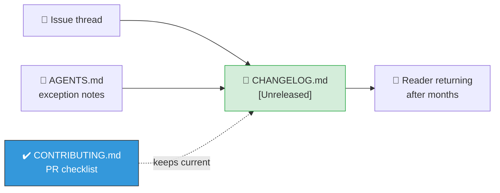

# Add a CHANGELOG.md recording notable changes

## Summary

The repository had no changelog, so notable behaviour shifts — the MNIST `CATEGORICAL_ERROR` →
`CROSS_ENTROPY` cost switch, the `Creature.forDataset(...)` factory adoption, the
`@stsoftware/neat-ai` bump — were recoverable only by reading issue threads and `AGENTS.md`
exception notes. This PR adds a root `CHANGELOG.md` in
[Keep a Changelog](https://keepachangelog.com/en/1.1.0/) format, seeded with `[Unreleased]` and
back-filled with those entries (each citing its driving issue), and adds a changelog item to the
`CONTRIBUTING.md` PR checklist so it stays current.

The repo publishes no package and carries no version tags, so the changelog documents this
explicitly: entries land under `[Unreleased]` and stay there.

Closes #721.

## Evidence

No web interface to screenshot — this is a documentation change. The deliverable is the published
artefact, so the tests assert on its content, matching the existing `security_md_test.ts` pattern.

New tests failing before the change, passing after:

```text
# before
FAILED | 0 passed | 4 failed (33ms)

# after
ok | 4 passed | 0 failed (6ms)
```



## Test Plan

Added `changelog_test.ts` (4 tests):

- `CHANGELOG.md exists at the repository root`
- `CHANGELOG.md follows the Keep a Changelog format` — top-level heading, format citation, and an
  `[Unreleased]` section
- `CHANGELOG.md is back-filled with issue-referenced entries` — every bullet cites a `(#NNN)` issue
- `CONTRIBUTING.md PR checklist keeps the changelog current`

`./quality.sh` passes (lint, `deno fmt --check`, unit tests, and every example runner).
