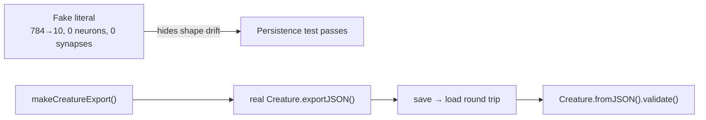

# PR Summary — Issue #722

## Summary

Replaced the hand-rolled fake `CreatureExport` fixtures in the MNIST phase-champion, MNIST
population-pool, and multi-run state tests with exports produced by real `Creature` instances.
Closes #722.

The old fixtures claimed `input: 784, output: 10` with **zero neurons and zero synapses** — a
creature no `Creature` could ever export — and `common/multi_run_state_test.ts` force-cast a partial
literal past the type checker with `as unknown as CreatureExport`. Because `CreatureExport` is a
plain value object rather than a boundary, faking it hid exactly the bugs worth catching: a
field-name typo, a missing required field, or drift in the exported shape.

Changes:

- **New shared test util** `common/creature_export_fixture.ts` —
  `makeCreatureExport({ input, output, hidden?, seed? })` builds a genuine creature and returns its
  export. Omitting `hidden` yields a fresh seed (`new Creature(input, output)`, exactly as the MNIST
  campaign builds one); a positive `hidden` yields a deterministic evolved-style topology via the
  existing `buildLargeCreature` helper. Invalid neuron counts fail loud with a thrown `Error`.
- **`mnist_classification/phase_champions_test.ts`** and
  **`mnist_classification/population_pool_test.ts`** — fixtures now come from `makeCreatureExport`
  at real `FEATURE_COUNT`/`CLASS_COUNT` dimensions. Assertions that only restated what the fake was
  built to satisfy (`neurons.length === 1`, `input === 784`) are replaced with whole-export
  round-trip fidelity checks.
- **`common/multi_run_state_test.ts`** — the `as unknown as CreatureExport` cast is gone; the helper
  now returns a real, seed-deterministic 1→1 export, and the round-trip test additionally asserts
  the persisted artefact reloads via `Creature.fromJSON(...).validate()`.
- **`AGENTS.md`** — new "Never hand-roll a `CreatureExport`" rule under Testing Philosophy pointing
  at the shared builder, so the fakes are not reintroduced.

No existing test was removed or commented out.

## Evidence

Backend/CLI change only — there is no web interface to screenshot. Evidence is the test run.

Building the fixtures from real creatures immediately surfaced behaviour the fakes had masked: a
real export carries optional fields whose value is `undefined` (`tags`, `type`, `frozen`), and
`JSON.stringify` drops those keys, so a persisted export is not deep-equal to the in-memory one. The
assertions now compare serialised forms (or use the production `creatureExportsEqual`), documenting
the real persistence behaviour.



Targeted run of the affected suites:

```text
deno test --no-check ... common/multi_run_state_test.ts \
  mnist_classification/phase_champions_test.ts \
  mnist_classification/population_pool_test.ts \
  common/creature_export_fixture_test.ts
ok | 39 passed | 0 failed (729ms)
```

Full parallel unit suite (the `quality.sh` gate these files run under):

```text
deno test --parallel --frozen --no-check ... --ignore=mnist_classification/evolve_integration_test.ts
ok | 1239 passed | 0 failed (13m23s)
```

`deno fmt`, `deno lint`, `deno check ./**/*.ts`, and `markdownlint-cli2` on the changed Markdown all
pass cleanly. The `quality.sh` example-runner sections were not re-run — this change touches test
fixtures only and no example source.

## Test Plan

Added — `common/creature_export_fixture_test.ts`:

- `makeCreatureExport builds a fresh seed the library can reload` — asserts arity, neuron/synapse
  counts, and that `Creature.fromJSON(...).validate()` accepts the export (the check a hand-rolled
  literal cannot pass).
- `makeCreatureExport fresh seeds differ between calls` — random initialisation gives distinct
  creatures, which the population-seeding tests rely on.
- `makeCreatureExport hidden variant is deterministic per seed` — same seed → identical export,
  different seed → different export, hidden neuron count honoured.
- `makeCreatureExport rejects invalid neuron counts` — error path for zero, negative, and
  non-integer `input` / `output` / `hidden`.

Modified — assertions strengthened, none removed:

- `mnist_classification/phase_champions_test.ts` — `savePhaseChampion` round trip and
  `maybeUpdateSampleRateChampion` now compare whole exports via `creatureExportsEqual` instead of
  `neurons.length === 1` / `input === 784`.
- `mnist_classification/population_pool_test.ts` — `saveSamplerLoopChampion` round trip and the
  `.creatures` refresh compare the full serialised export.
- `common/multi_run_state_test.ts` — real export fixtures throughout; the round-trip test also
  validates the reloaded creature.
