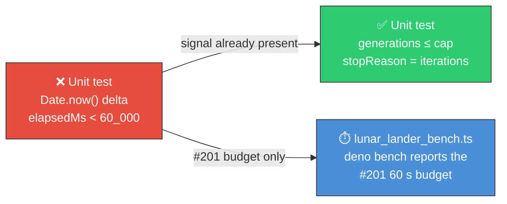

# Remove wall-clock `elapsedMs < 60_000` assertions from six unit tests

## Summary

Six unit tests asserted a wall-clock threshold (`assert(elapsedMs < 60_000, …)`) measured from
`Date.now()` deltas, which breaches this repo's own convention in
[AGENTS.md](../../../AGENTS.md#-unit-tests-vs-benchmarks) rule 1: _"Do not put timing assertions in
unit tests. If a test checks `performance.now()` or `Date.now()` deltas it belongs in a benchmark."_
`deno test` runs files in parallel, so a loaded CI runner could breach 60 s and fail the suite with
no behavioural regression, while a genuine slowdown staying under 60 s was never caught.

Every site already carried the behavioural assertion that holds the real signal (the
generation/iterations cap), so the timing assertion and its `Date.now()` bookkeeping were removed
and the behavioural assertions kept. Closes #724.

The one site with a genuine performance requirement — the issue #201 quick-mode 60-second budget —
was **moved to a benchmark** (`lunar_lander/lunar_lander_bench.ts`) so the figure is measured in
isolation and reported by `deno bench`, per the AGENTS.md table. Its unit test now asserts the
behavioural contract instead: quick mode exits via `stopReason === "iterations"` and stops at the
`QUICK_ITERATIONS` cap.

## Evidence

This is a test-hygiene change with no web interface to screenshot.



All six affected tests pass with the timing assertions removed:

```
$ deno test --filter "honours the iterations" cart_pole/ lunar_lander/ maze_navigation/ mountain_car/ snake_game/
ok | 5 passed | 0 failed | 169 filtered out (1s)

$ deno test --filter "quick-mode budget" lunar_lander/lunar_lander_test.ts
ok | 1 passed | 0 failed | 73 filtered out (129ms)
```

The new benchmark reports the #201 quick-mode budget in isolation — comfortably inside 60 s:

```
$ deno bench --allow-read --allow-write --allow-env lunar_lander/
| lunar_lander: quick-mode evolveLanderController (issue #201 60s budget) | 37.6 ms | 26.6/s | (30.7 ms … 40.8 ms) |
```

`./quality.sh` passes.

## Test Plan

Tests modified (timing assertion + `Date.now()` bookkeeping deleted, behavioural assertions kept):

- `cart_pole/cart_pole_test.ts` — "evolveCartPoleController honours the iterations cap"
- `lunar_lander/lunar_lander_test.ts` — "evolveLanderController honours the iterations generation
  cap"
- `lunar_lander/lunar_lander_test.ts` — "quick-mode budget … ends fast (issue #201)"; the deleted
  wall-clock assertion is **replaced** by an `assertGreaterOrEqual(QUICK_ITERATIONS, …)` check on
  the generation cap so the test still fails if quick mode stops honouring its budget behaviourally
- `maze_navigation/maze_navigation_test.ts` — "evolveMazeController honours the iterations
  generation cap"
- `mountain_car/mountain_car_test.ts` — "evolveMountainCarController honours the iterations cap"
- `snake_game/snake_game_test.ts` — "evolveSnakeController honours the iterations cap"

Added:

- `lunar_lander/lunar_lander_bench.ts` — `deno bench` entry measuring a quick-mode
  `evolveLanderController` run, so the #201 60-second budget is reported rather than asserted in the
  parallel test runner.

Documentation:

- `lunar_lander/README.md` — the CI fast-path section now points at the benchmark as the home of the
  60-second budget.

No tests were commented out or removed — only the timing assertions the repo's own convention
forbids.
