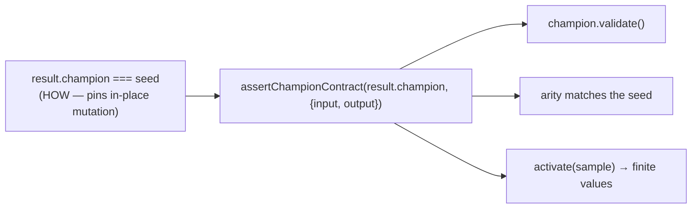

# Replace `champion === seed` identity pins with behavioural assertions

## Summary

Six example suites asserted that the evolution result's champion was **the same JavaScript object**
as the seed creature passed in. That pins _how_ the champion is produced — NEAT-AI's `evolveDir`
currently mutates the caller's creature in place — rather than _what_ the champion is, which the
[AGENTS.md testing philosophy](../../../AGENTS.md#-testing-philosophy) forbids. A
behaviour-preserving upstream change that returned a fresh champion with identical content would
fail all six tests with no real regression.

Each site now asserts the observable contract instead, via a new shared helper
`common/champion_contract.ts`: the champion **validates**, keeps the **seed's input/output arity**,
and **activates to a finite output vector** of the right length. The two suites that also read final
topology counts off the seed (`mcmc_acceptance`, `crossover`) now read them off `result.champion`,
which is the value the summary actually describes.

Closes #725.

## Evidence

Backend/test-only change — no web interface to screenshot. Verified by running the affected suites:

```
deno test --parallel … common/champion_contract_test.ts discovery/… discovery_at_scale/… \
  crossover/… evolution_showcase/… intelligent_design/… mcmc_acceptance/…
ok | 149 passed | 0 failed (8s)
```

`./quality.sh` passes (format, lint, type check, unit tests, examples).

What changed at each site:



Sites updated:

| Suite                                               | Change                                                  |
| --------------------------------------------------- | ------------------------------------------------------- |
| `discovery/discover_missing_neuron_test.ts`         | identity check → `assertChampionContract`, test renamed |
| `discovery_at_scale/discovery_at_scale_test.ts`     | identity check → `assertChampionContract`, test renamed |
| `crossover/crossover_example_test.ts`               | identity check + seed-derived final counts → champion   |
| `evolution_showcase/evolution_showcase_test.ts`     | identity check → `assertChampionContract`               |
| `intelligent_design/improve_squash_example_test.ts` | identity check → `assertChampionContract`, test renamed |
| `mcmc_acceptance/mcmc_acceptance_test.ts`           | identity check + seed-derived final counts → champion   |

No test was deleted or commented out — every assertion was replaced by a stronger, behaviour-based
one.

## Test Plan

- Added `common/champion_contract_test.ts` covering the new helper:
  - happy path — a valid creature of the expected arity;
  - an evolved-style creature with hidden neurons (built via `makeCreatureExport`);
  - error paths — mismatched input count, mismatched output count;
  - edge case — a NaN output bias makes activation non-finite and the helper fails loud.
- Re-ran the six updated example suites; all pass.

## Documentation

- `AGENTS.md` — new ❌ "How" test bullet naming reference-identity assertions, and a
  `common/champion_contract.ts` row in the Shared Utilities table.
